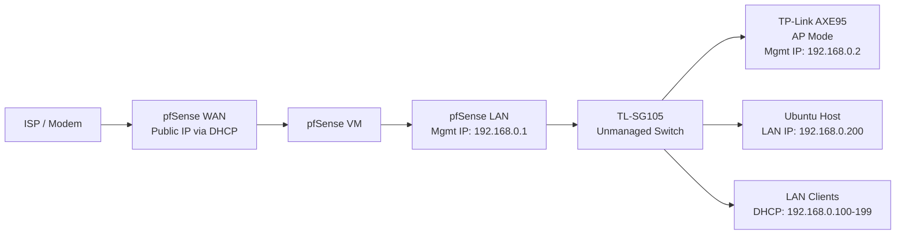

# pfSense on Ubuntu Home Server

This README will document how I configured `pfSense as a virtual router/firewall` on my `Ubuntu Home Server` using `QEMU/KVM and virt-manager`

The goal is to move routing/firewall to a dedicated system instead of using a standard, consumer router. This provides flexibility and separates responsibilities: virtualized pfSense to handle routing/firewall and previous all-in-one router functioning solely as the Access Point (AP).

This README functions as both:
- A personal reference for rebuilding/troubleshooting
- A homelab project write-up

---

## Overview

Deployed `pfSense in a VM` on my Ubuntu Server and used it as the primary router/firewall for my home network.

### Goals
- Run pfSense virtually on my Ubuntu host
- Use pfSense as the main LAN gateway
- Run previous all-in-one router in `AP Mode`
- Keep the setup simple and stable, making future updates easier such as:
    - VLANs
    - Managed Switching
    - Stronger network segmentation

---

## Lab Hardware

### Main Workstation

Dual-boot workstation with Linux Mint as the primary OS and Windows 11 for compatibility. Used for development, coursework, gaming, and general use.

- Pre-built PC
    - `Case`: Corsair 5000D AIRFLOW Mid-Tower ATX
    - `Motherboard`: Gigabyte B550 GAMING X V2
    - `CPU`: AMD Ryzen 7 5700X
    - `RAM`: 32GB (2x16GB) DDR4 @ 3200 MHz
    - `GPU`: AMD Radeon RX 6800XT 16GB VRAM
    - `OS`:
        - `Windows 11`: Western Digital Blue SN550 500GB
        - `Linux Mint`: Samsung SSD 970 EVO Plus 1TB

- Peripherals
    - `Monitor` 
        - `Main`: Sceptre 27-inch 2560x1440 @ 144Hz
        - `Secondary`: Asus VG248QE 1920x1080 @ 144Hz
    - `Keyboard`: Logitech MX Keys S Wireless
    - `Mouse`: Logitech MX Master 4 Wireless
    - `Mousepad`: Glorious XXL Extended Black

### Ubuntu Host

Primary homelab server used for virtualization, NAS services, and hosting the pfSense router/firewall VM.

- Dell OptiPlex 7050 SFF
    - `Motherboard`: Dell 0NW6H5
    - `CPU`: Intel i7-7700 @ 3.60GHz
    - `RAM`: 24GB DDR4 (1x8GB + 2x8GB) @ 2133MHz
    - `Boot Drive`: Micron 256GB SATA III M.2 2280
    - `Storage Pool`: 2x PNY CS900 1TB (ZFS mirror)
    - `Hypervisor`: QEMU/KVM with virt-manager
        - `ISO`: pfSense CE (FreeBSD)

### Networking Gear

Core networking hardware used for routing, switching, and wireless access.

- `Access Point`: TP-Link Archer AXE95
- `Switch`: TP-Link TL-SG105 (**unmanaged**)
- `NIC`: Intel I350-AM2 (dual-port)
    - Dedicated WAN/LAN connectivity for pfSense VM

---

## Network Design Plan

### Notes
- pfSense became the `default gateway` for LAN clients.
- The all-in-one AXE95 was moved into AP mode only.
- DHCP for the LAN is handled by pfSense.

- Static IP Addresses:
    - `Ubuntu Host`: 192.168.0.200

- DHCP Reservations:
    - `Main Workstation`: 192.168.0.201
    - `Laptop`: 192.168.0.202
    - `Main Phone`: 192.168.0.203
    - `Backup Phone`: 192.168.0.204

---

