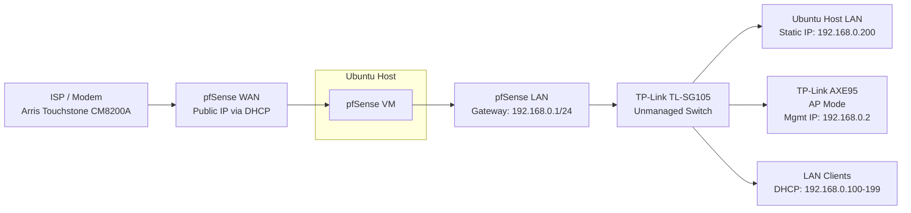

# Homelab

This repository documents my personal homelab: hardware, networking, virtualization, and infrastructure projects I build for learning, experimentation, and long-term reference.

This homelab is centered around an Ubuntu-based home server, a virtualized pfSense router/firewall, local storage services, and a small home network that I can expand over time.

## Purpose

This repository serves as:

- Personal refrence for rebuilding and troubleshooting
- Portfolio of practical infrastructure and networking projects
- Place to document experiments before applying them to production

## Focus

- pfSense virtual router/firewall
- Home network topology and documentation
- Static addressing and DHCP reservations
- VPN and remote access
- Future VLAN segmentation
- Future managed switching

## Network Topology

## Lab Hardware

### Main Workstation

Dual-boot workstation with Linux Mint as the primary OS and Windows 11 for compatibility. Used for development, coursework, gaming, and general use.

- Pre-built PC
    - `Case`: Corsair 5000D AIRFLOW Mid-Tower ATX
    - `Motherboard`: Gigabyte B550 GAMING X V2
    - `CPU`: AMD Ryzen 7 5700X
    - `RAM`: 32GB (2x16GB) DDR4 @ 3200 MHz
    - `GPU`: AMD Radeon RX 6800XT 16GB VRAM
    - `OS`:
        - `Windows 11`: Western Digital Blue SN550 500GB
        - `Linux Mint`: Samsung SSD 970 EVO Plus 1TB

- Peripherals
    - `Monitor` 
        - `Main`: Sceptre 27-inch 2560x1440 @ 144Hz
        - `Secondary`: Asus VG248QE 1920x1080 @ 144Hz
    - `Keyboard`: Logitech MX Keys S Wireless
    - `Mouse`: Logitech MX Master 4 Wireless
    - `Mousepad`: Glorious XXL Extended Black

### Ubuntu Host

Primary homelab server used for virtualization, NAS services, and hosting the pfSense router/firewall VM.

- Dell OptiPlex 7050 SFF
    - `Motherboard`: Dell 0NW6H5
    - `CPU`: Intel i7-7700 @ 3.60GHz
    - `RAM`: 24GB DDR4 (1x8GB + 2x8GB) @ 2133MHz
    - `Boot Drive`: Micron 256GB SATA III M.2 2280
    - `Storage Pool`: 2x PNY CS900 1TB (ZFS mirror)
    - `Hypervisor`: QEMU/KVM with virt-manager
        - `ISO`: pfSense CE (FreeBSD)

### Networking Gear

Core networking hardware used for routing, switching, and wireless access.

- `Modem`: Arris Touchstone CM8200A
- `Access Point`: TP-Link Archer AXE95
- `Switch`: TP-Link TL-SG105 (**unmanaged**)
- `NIC`: Intel I350-AM2 (dual-port)
    - Dedicated WAN/LAN connectivity for pfSense VM

## Projects

### pfSense
Virtualized router/firewall running on the Ubuntu Host.

Includes:
- VM Setup
- WAN/LAN Design
- LAN DHCP Configuration
- AP Mode Migration
- Troubleshooting Notes

See: 
1. [pfSense](pfSense/README.md) 
2. [pfSense Setup](pfSense/setup/README.md)

### Ubuntu
Complete walkthrough on virtualizing Ubuntu.

Includes:
- QEMU/KVM and virt-manager installation
- Full Ubuntu LTS VM setup
- Screenshots included

See: 
1. [Ubuntu Setup](virtualization/ubuntu/README.md)

### Windows Server 2025
Complete walkthrough on virtualizing Windows Server 2025.

Includes:
- Full Windows Server VM setup
- Separate Active Directory documentation
- Screenshots included

See: 
1. [Windows Server 2025 Setup](virtualization/windows-server-2025/README.md)
2. [Active Directory](projects/enterprise-simulation/docs/active-directory.md)

### Windows 11 VM
Complete walkthrough on virtualizing Windows 11.

Includes:
- QEMU/KVM and virt-manager installation
- Clean Windows 11 Installation
- Screenshots included

See: 
1. [Windows 11 Setup](virtualization/windows-11/README.md)

