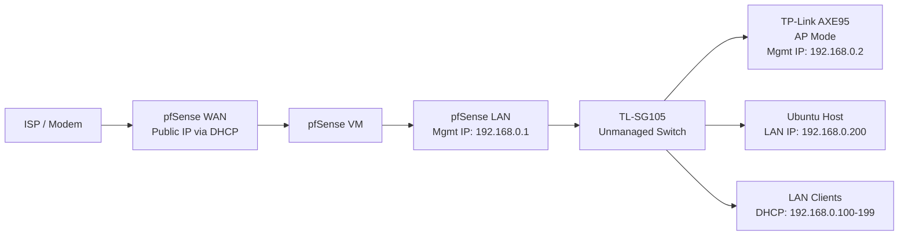

# pfSense on Ubuntu Home Server

This README will document how I configured `pfSense as a virtual router/firewall` on my `Ubuntu Home Server` using `QEMU/KVM and virt-manager`

The goal is to move routing/firewall to a dedicated system instead of using a standard, consumer router. This provides flexibility and separates responsibilities: virtualized pfSense to handle routing/firewall and previous all-in-one router functioning solely as the Access Point (AP).

This README functions as both:
- A personal reference for rebuilding/troubleshooting
- A homelab project write-up

For a generic pfSense installation as a VM, see: [pfSense Setup](./setup/README.md)

---

## Overview

Deployed `pfSense in a VM` on my Ubuntu Server and used it as the primary router/firewall for my home network.

### Goals
- Run pfSense virtually on my Ubuntu host
- Use pfSense as the main LAN gateway
- Run previous all-in-one router in `AP Mode`
- Keep the setup simple and stable, making future updates easier such as:
    - VLANs
    - Managed Switching
    - Stronger network segmentation

---

## Infrastructure Topology

### Server
- Dell OptiPlex 7050 SFF
- Ubuntu
- QEMU/KVM
- virt-manager

### Networking Gear
- Arris Touchstone CM8200A
- Intel I350-AM2 (dual-port NIC)
- TP-Link AXE95 (AP Mode)
- TP-Link TL-SG105 Switch (unmanaged)

---

## Network Topology

### Notes
- pfSense became the `default gateway` for LAN clients.
- The all-in-one AXE95 was moved into AP mode only.
- DHCP for the LAN is handled by pfSense.

- Static IP Addresses:
    - `Ubuntu Host`: 192.168.0.200

- DHCP Reservations:
    - `Main Workstation`: 192.168.0.201
    - `Laptop`: 192.168.0.202
    - `Main Phone`: 192.168.0.203
    - `Backup Phone`: 192.168.0.204

---
