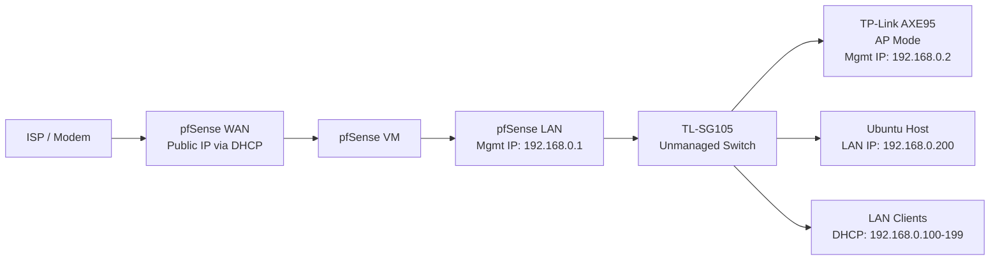

# pfSense on Ubuntu Home Server

This documents an overview on my home network's transition from a tradition consumer all-in-one router to `pfSense running as a virtual machine` on my `Ubuntu Home Server` using `QEMU/KVM and virt-manager`.

Instead of relying on an all-in-one router for routing, firewalling, and wireless access, I split those responsibilities across dedicated components:

- `pfSense VM` handles routing, firewalling, and DHCP.
- Previous all-in-one router now operates only in `Access Point (AP) mode`.
- `QEMU/KVM` as the hypervisor on my Ubuntu Server

This README is intended to serve as a **high-level project overview** of the live deployment, including the network layout, hardware, and design goals.

For a generic pfSense installation as a VM, see: [pfSense Setup](./setup/README.md)

## Overview

Deployed `pfSense in a VM` on my Ubuntu Server and used it as the primary router/firewall for my home network.

This setup gives me more control over networking while keeping the design simple and expandable. It also creates a stronger foundation for future improvements such as:

- VLANs
- Managed switching
- Stronger network segmentation
- Additional firewall rules and services

## Server and Hardware

### Server
- Dell OptiPlex 7050 SFF
- Ubuntu
- QEMU/KVM
- virt-manager

### Networking Hardware
- Arris Touchstone CM8200A
- Intel I350-AM2 (dual-port NIC)
- TP-Link AXE95 (AP Mode)
- TP-Link TL-SG105 Switch (unmanaged)

## Network Topology

## Configuration Notes
- pfSense became the `default gateway` for LAN clients.
- The all-in-one AXE95 was moved into AP mode only.
- DHCP for the LAN is handled by pfSense.
- Ubuntu host remains on the LAN as a normal client/server system

- Static IP Addresses:
    - `Ubuntu Host`: 192.168.0.200

- DHCP Reservations:
    - `Main Workstation`: 192.168.0.201
    - `Laptop`: 192.168.0.202
    - `Main Phone`: 192.168.0.203
    - `Backup Phone`: 192.168.0.204

## Why This Setup
Running pfSense virtually on my Ubuntu server gives me a more flexible and capable network design than a standard consumer router alone.

It also makes the network easier to expand over time as I continue building and experimenting with my homelab such as segmentation, additional services, and more advanced firewall rules.
