# pfSense Setup

This document describes a similar process of how I set up `pfSense CE as a virtual router/firewall` on my Ubuntu home server using `QEMU/KVM and virt-manager`.

> [!note]
> This documents a general pfSense installation in a safe virtual lab using isolated libvirt networks. The overall installation process, interface assignment, console setup, and webConfigurator steps are very similar to a real pfSense deployment. The main difference is that this lab uses isolated virtual networks instead of real WAN/LAN interfaces.

## Overview

In this lab, pfSense is installed as a virtual machine with:

- **1 WAN interface** connected to an **isolated lab WAN network**
- **1 LAN interface** connected to an **isolated lab LAN network**
- A separate **Ubuntu VM** connected to the pfSense LAN for accessing the web interface

Because both networks are isolated, this setup does not touch any physical NICs, bridges, or the real router.

## Goal

The goal of this project was to move routing and firewall responsibilities away from a consumer, all-in-one router setup and into a more flexible homelab design.

The intended final design is:

- pfSense acts as the primary router/firewall
- AXE95 runs in AP Mode
- LAN uses the subnet: `192.168.0.0/24`
- pfSense provides DHCP for clients
- The Ubuntu Host remains reachable on a static LAN IP: `192.168.0.200`

## Starting Environment

Before this setup:

- Home network was already running on the `192.168.0.0/24` subnet.
- The Ubuntu Host was hosting virtualization with `QEMU/KVM`
- pfSense was planned to run as a VM on the Ubuntu Host
- The Wireless Router would later be converted into an `Access Point`

## Lab Topology

```mermaid
flowchart LR
    WANLAB[libvirt isolated network<br/>pfsense-lab-wan] --> PF[pfSense VM]
    PF --> LANLAB[libvirt isolated network<br/>pfsense-lab-lan]
    LANLAB --> UBUNTU[Ubuntu Host]
```

## Requirements

Before starting, make sure the Ubuntu host has:

- QEMU/KVM installed
- virt-manager installed
- libvirt running properly
- pfSense CE ISO downloaded

If setting up virtualization from scratch, see: [Ubuntu VM Setup](../../virtualization/ubuntu-vm/README.md)

## 1. Create the isolated lab networks

Open `virt-manager`.

2. In the top menu, click **Connection Details**
3. Go to the section **Virtual Networks**
4. Create a new virtual network:
    - Name: `pfsense-lab-wan`
    - Mode: `Isolated`
    - Subnet: `172.16.100.0/24`

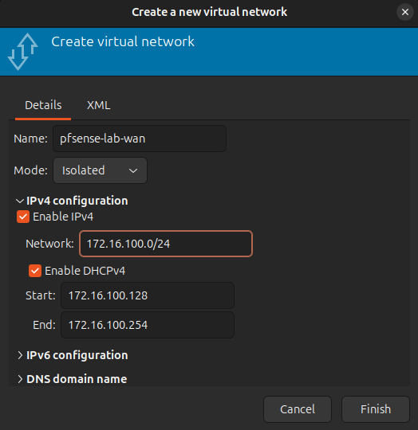

5. Create another virtual network:
    - Name: `pfsense-lab-lan`
    - Mode: `Isolated`
    - Subnet: `192.168.250.0/24`
    - DHCP: `Unchecked` (We want pfSense to handle DHCP)

At the end of this step, there should be two separate isolated lab networks available for VM attachment.

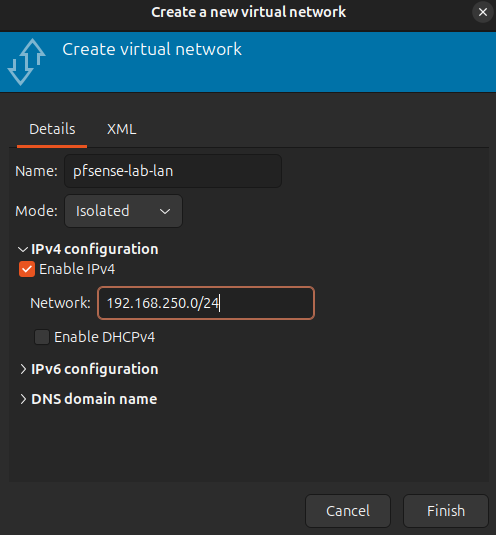

## 2. Create the pfSense VM

Create a new VM in `virt-manager`.

1. When selecting the ISO, the operating system may not be automatically detected.
    - Uncheck: `Automatically detect from the installation media / source`
    - Search: `FreeBSD`
    - Select: `Generic or unknown OS. Usage is not recommended. (generic)`

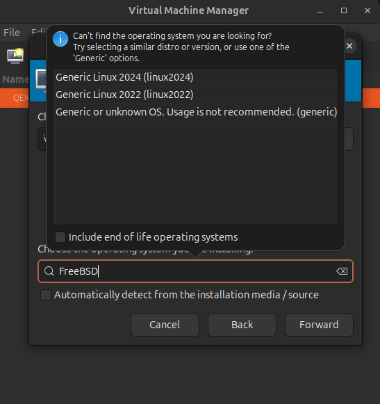

For this lab, this will be the VM settings I will be using:

- `Name`: pfsense-lab
- `Memory`: 2048
- `CPUs`: 2
- `Disk`: 20GB

> Make sure you check: `Customize configuration before install`

- `Network Selection`: Virtual network **pfsense-lab-wan**: Isolated network

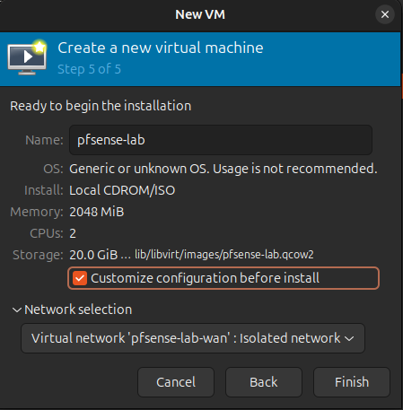

Click `Finish`.

### Ensure both NICs are attached

Change `Device model` for the **pfsense-lab-wan** to `virtio`. Click `Apply`.

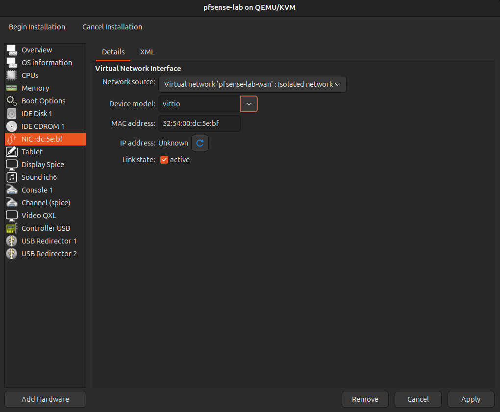

Then select `Add Hardware` and add the second virtual network.

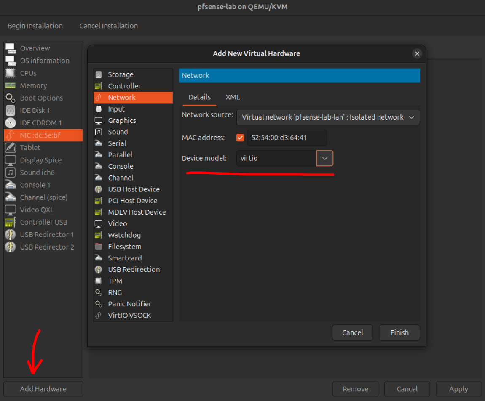

You should now have two virtual networks attached to the VM.
- Make sure both device models are `virtio`.

At the top, select `Begin Installation`.

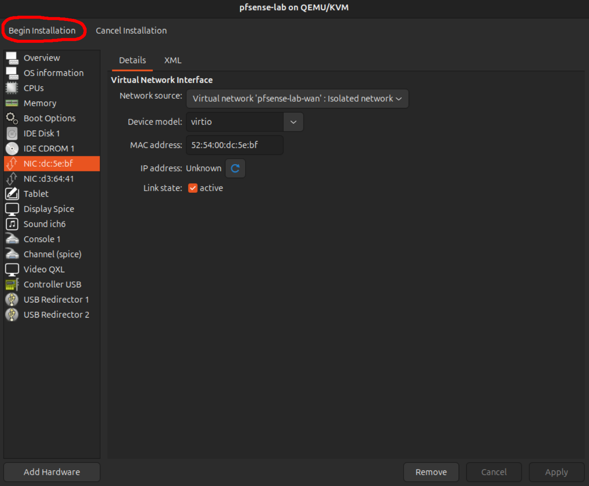

## 3. pfSense Installer

After installation completes, you should reach the `pfSense Installer`.

On this screen, press `Enter` on your keyboard.

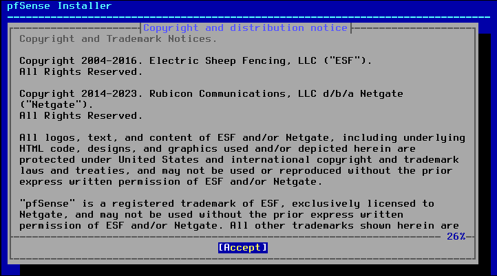

And continue with the installation. Default settings are mostly good except a couple of steps.

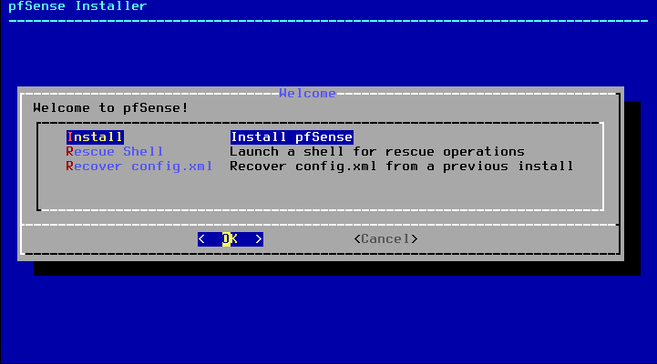

When asked about partitioning your disk, we will select UFS.
- Both are valid options, UFS is more lightweight compared to ZFS. We only allocated 2 GB of RAM.

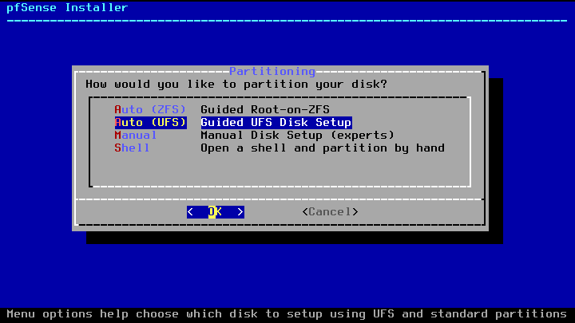

Since this is a fresh VM, there's nothing to preserve. Select `Entire Disk`.

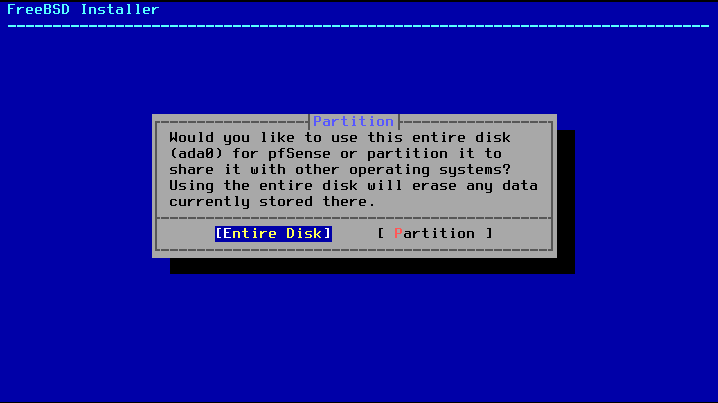

For the `Partition Scheme`, select **GPT: GUID Partition Table**.
    - GPT is preferred for modern disk partitioning.
    - MBR is legacy, used for older BIOS systems.
    - APM is for Apple
    - BSD is used to subdivide a disk slice into logical partitions.

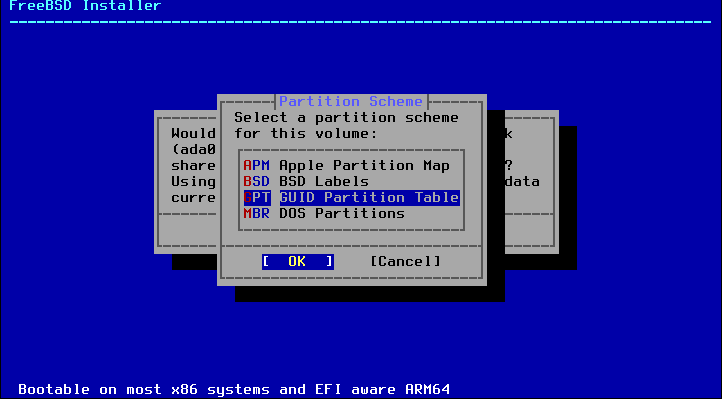

Review the disk setup, select `Finish` and `Commit` the changes.

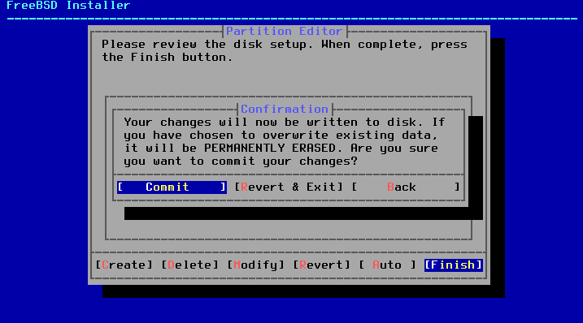

Once pfSense finished installing, reboot the system.

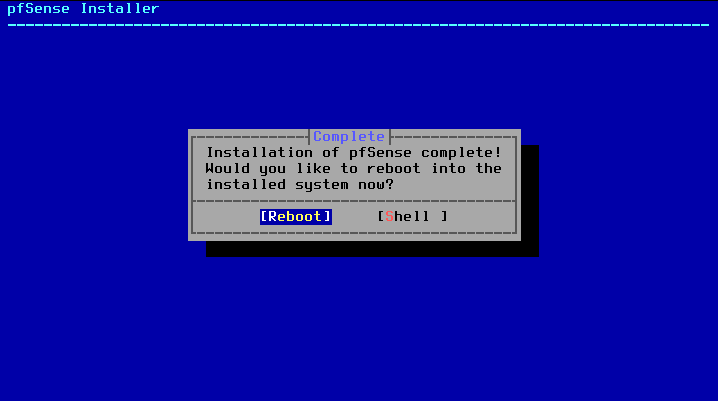

## 4. Assign WAN and LAN interfaces

After rebooting, pfSense will proceed with the initial installation.

If asked about VLANs, type `n`.

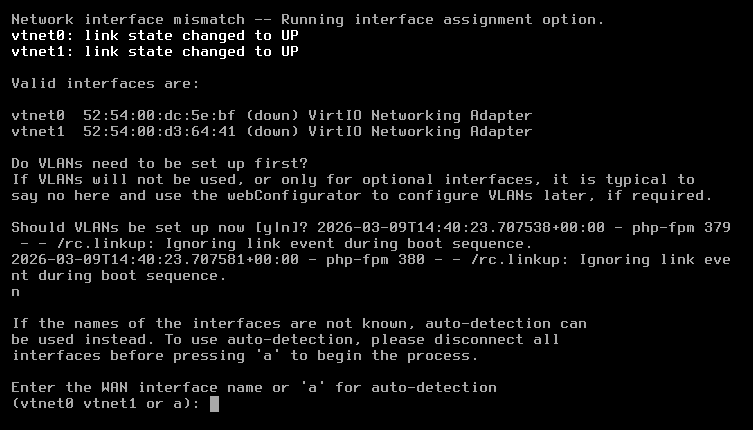

It might say that the names of the interfaces are not known and auto-detected can be used. However, we are going to compare the `Valid Interfaces` with the MAC address.

In my case:
- vtnet0: `52:54:00:dc:5e:bf`
- vtnet1: `52:54:00:d3:64:41`

When clicking on `Show virtual hardware details`, we will compare the two. In my case, **pfsense-lab-wan** has the MAC address `52:54:00:dc:5e:bf`. So we know that **pfsense-lab-wan** is vtnet0, which means **pfsense-lab-lan** is vtnet1.

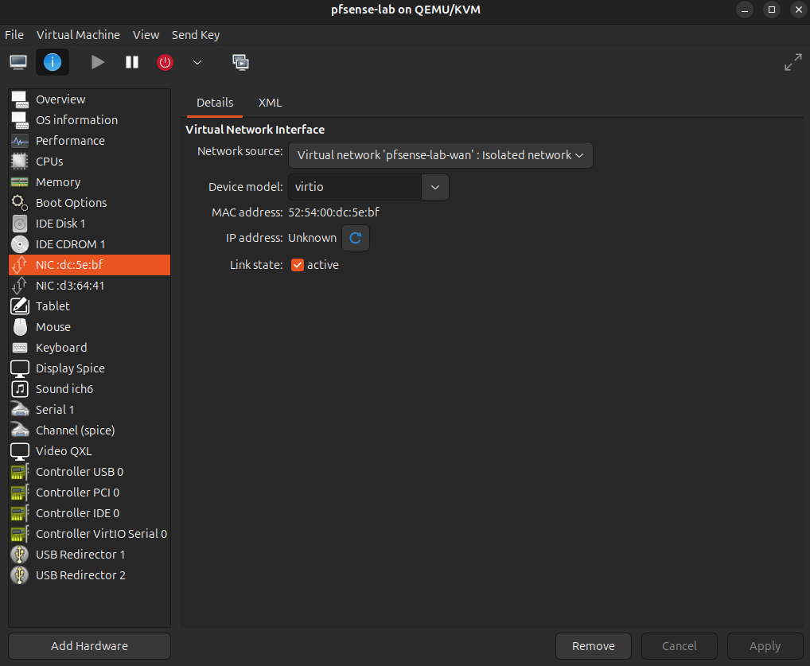

So for the WAN interface, we will enter `vtnet0`
For the LAN interface, we will enter `vtnet1`

Confirm the interfaces and proceed by typing `y`.

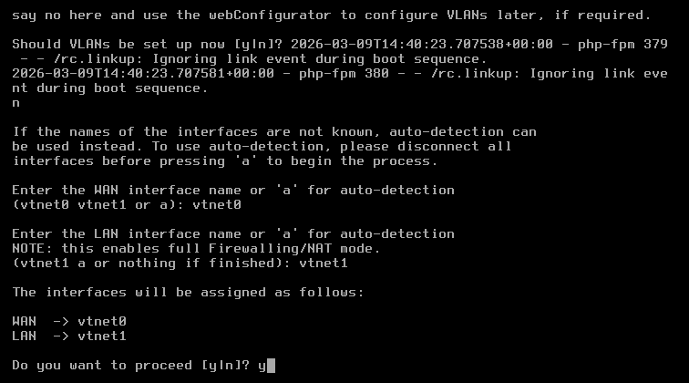

## 5. Verify console menu

If everything has been configured correctly, you will arrive at this screen.

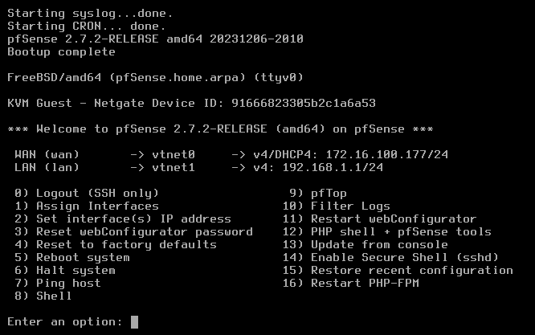

> The steps have been similar minus a few details. In the case of my real home network, I created a bridge for my WAN and LAN. Then instead of using isolated WAN and LAN network interfaces, I used the bridge interfaces.

However, since we're using isolated virtual networks. We should still be able to access the pfSense web UI.

## 6. Configure pfSense LAN

In this lab, the Ubuntu VM is acting as the virtualization host for the pfSense VM.

The isolated LAN network `pfsense-lab-lan` created in libvirt already has a host-side bridge interface:

- virbr2: `192.168.250.1/24`

Because of that, the cleanest way to access the pfSense web UI from the Ubuntu host is to place the pfSense LAN interface in the same subnet.

### Set the pfSense LAN IP

Right now, our pfSense LAN IP is: `192.168.1.1/24`.

1. In the pfSense console, we enter option: `2`.

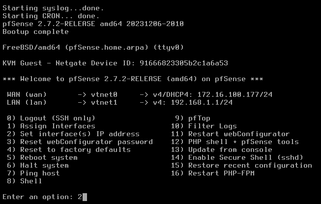

2. Then we want to configure the LAN interface: `2`.
3. Configure LAN IPv4 via DHCP: `n`
4. New LAN IPv4 address: `192.168.250.2`

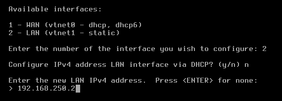

5. Subnet bit: `24`
6. Upstream gateway: `none` 
7. Configure LAN IPv6 via DHCP: `n`
8. New LAN IPv6 address: `none` (We will only be using IPv4 for simplicity)
9. We will enable DHCP server to simulate a real network
10. DHCP Start: `192.168.250.150`
11. DHCP End: `192.168.250.200`

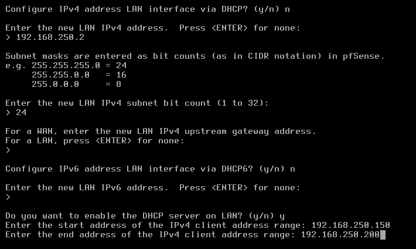

12. Revert to HTTP as webConfigurator: `n` (By default, pfSense uses HTTPS which is more secure than HTTP)

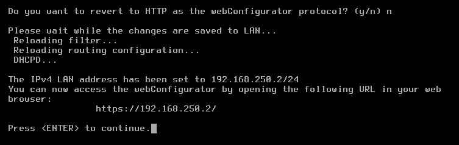

## 7. Configure pfSense Web UI

Verify that the Ubuntu Host can reach the pfSense Web UI at `https://192.168.250.2`.

If you reach this screen, it's pfSense presenting a self-signed HTTPS certificate. Firefox does not trust it by default, but the warning is normal.

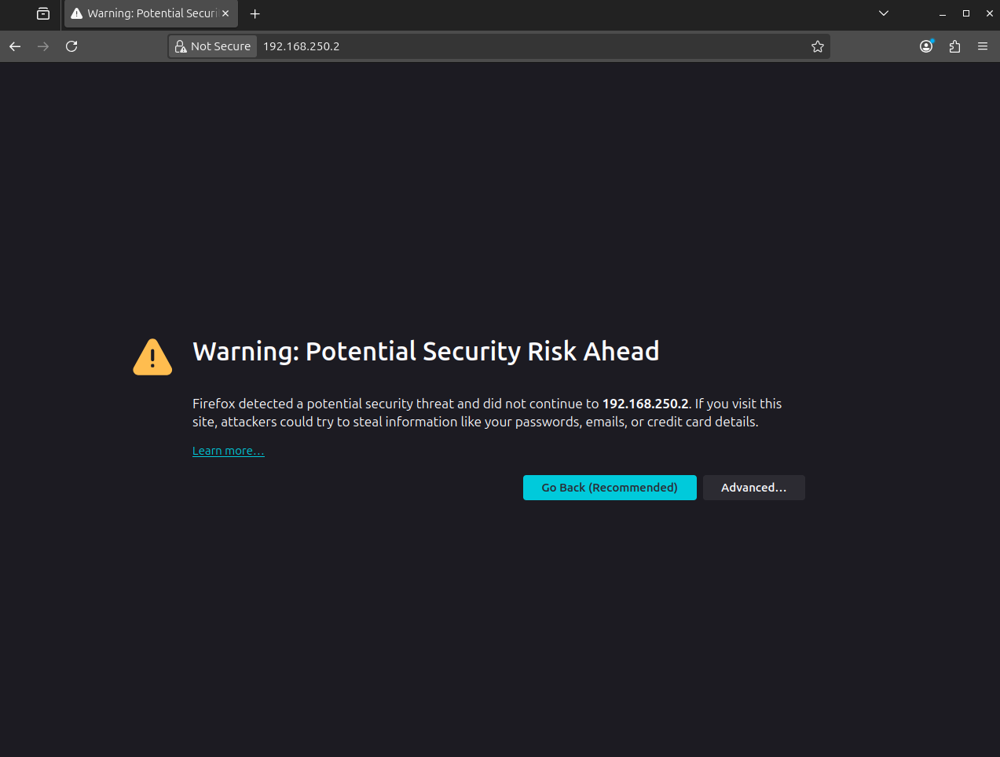

Proceed by clicking `Advanced...` and `Accept the Risk and Continue`.

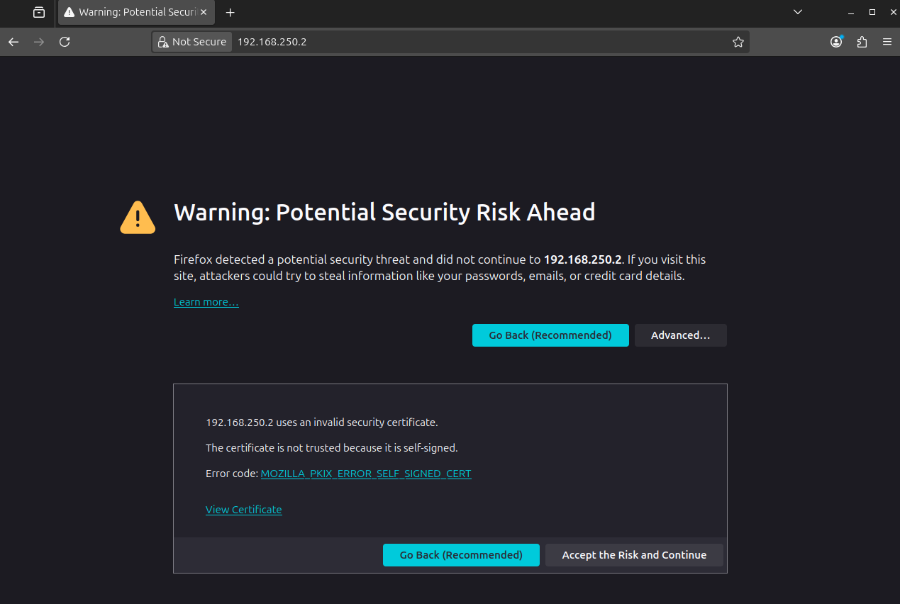

Once continuing, you will reach the sign in page for pfSense.

Default credentials:
- `Username`: admin
- `Password`: pfsense

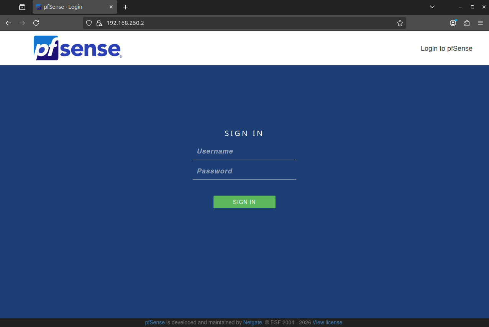

You will then reach the initial configuration of pfSense.

Since we're configuring a generic installation of pfSense, default settings can mostly be used.

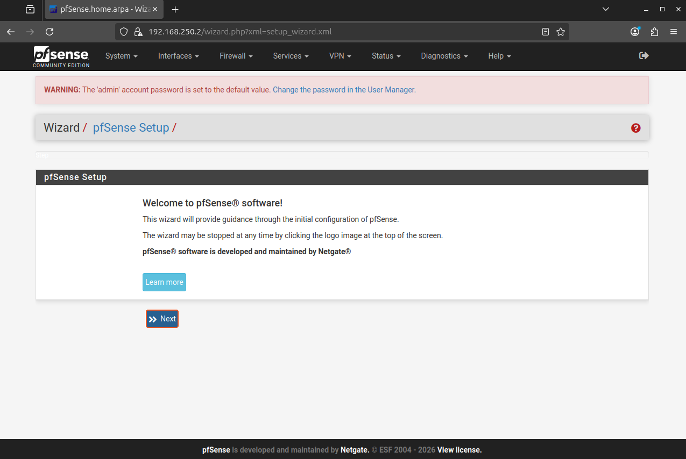
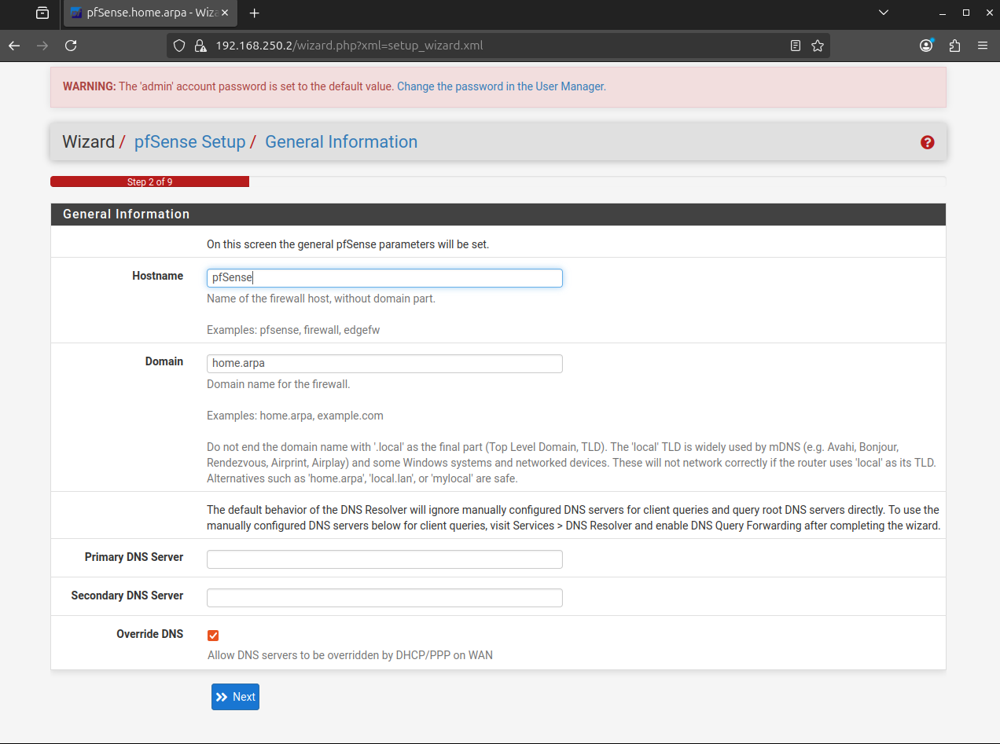
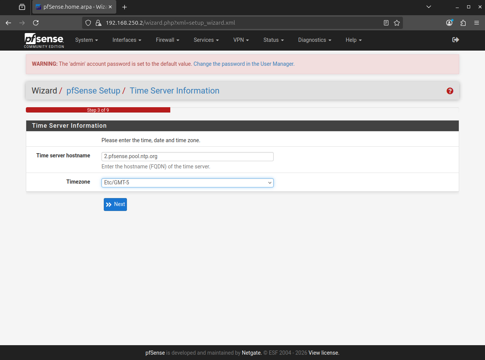

> Make sure you change the admin password!

Once complete, pfSense will reload.

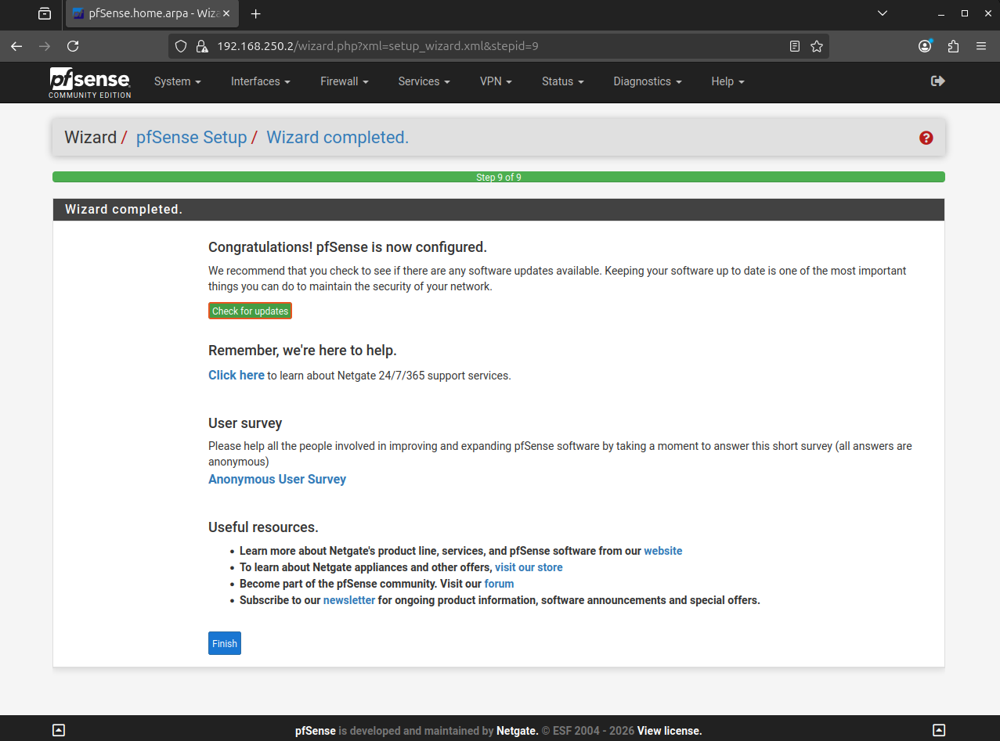

Congratulations! You've successfully setup pfSense as a virtual router/firewall!

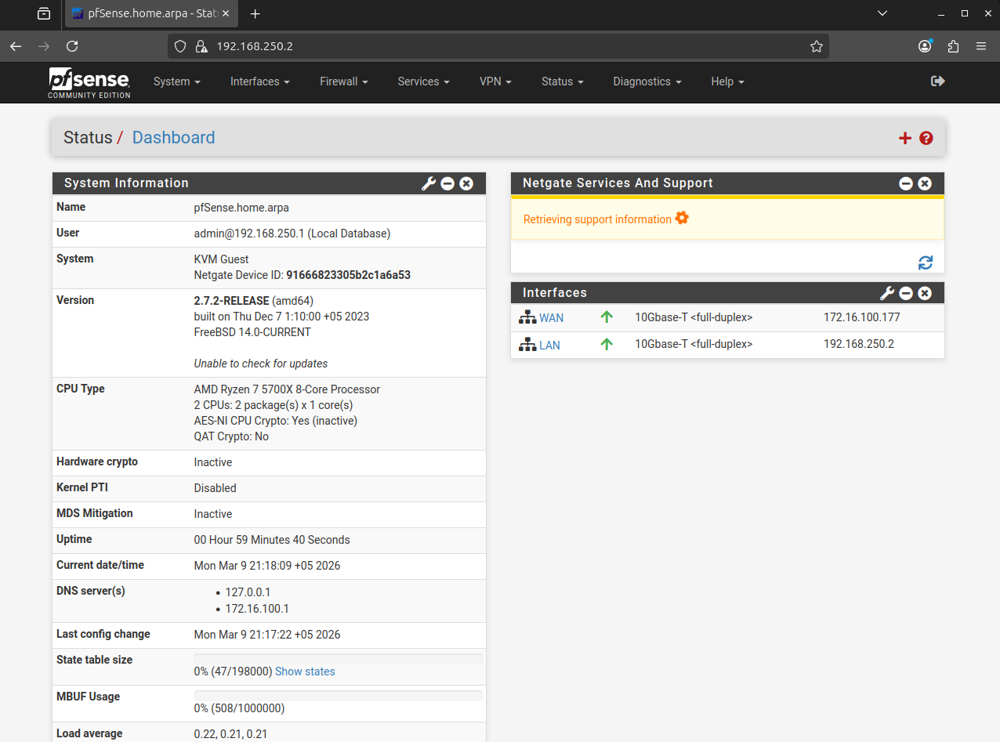

## Testing pfSense

- Eventually will create another client VM that will use pfSense to simulate a network.
