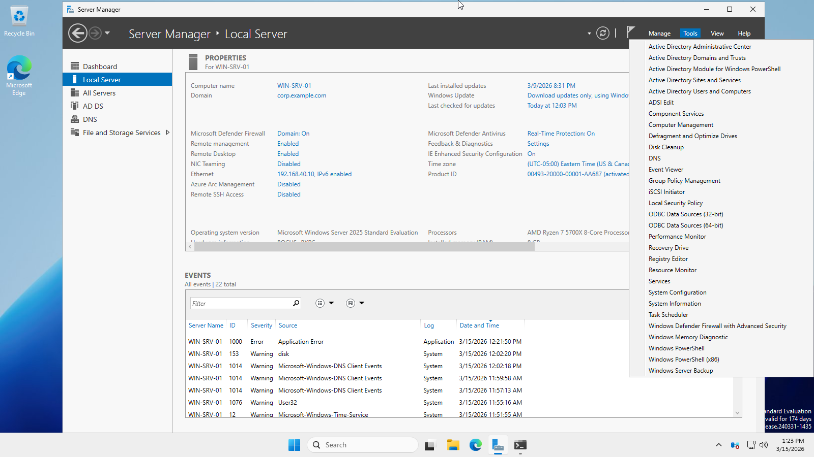
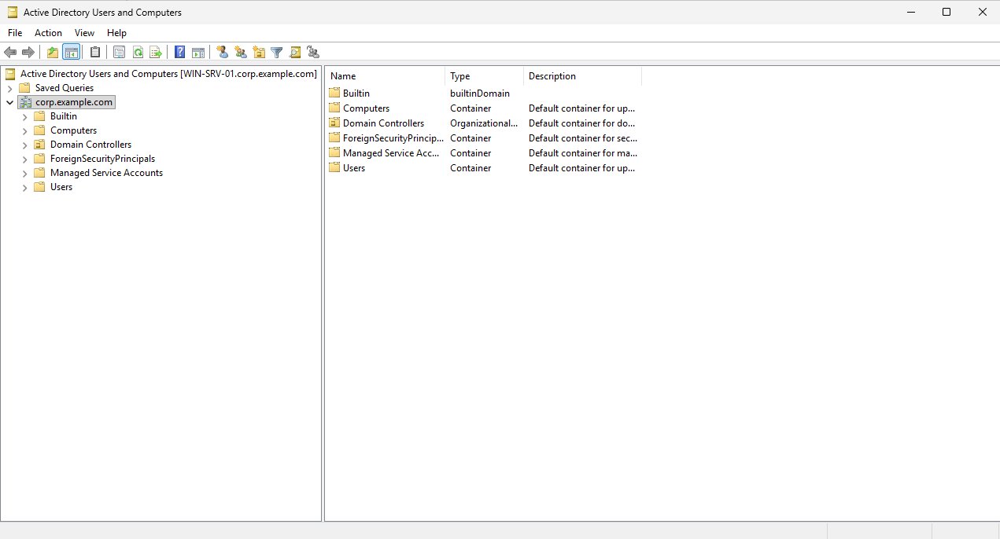
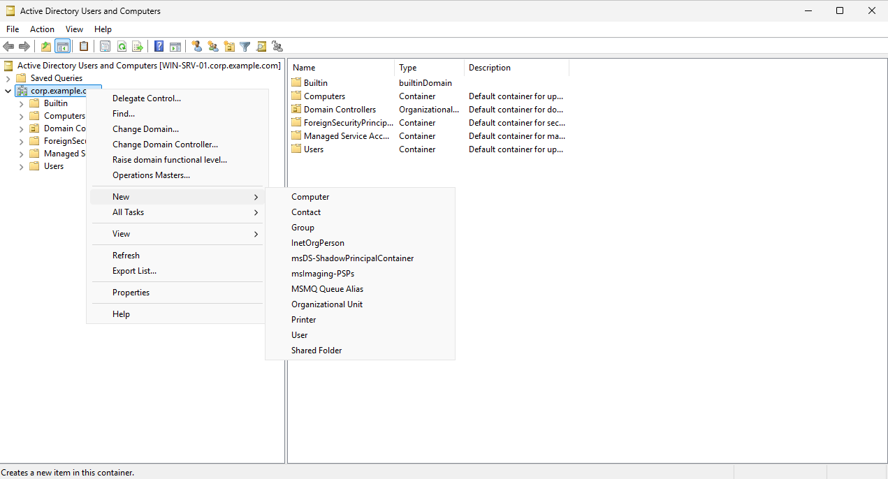
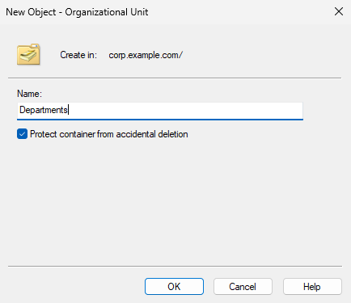
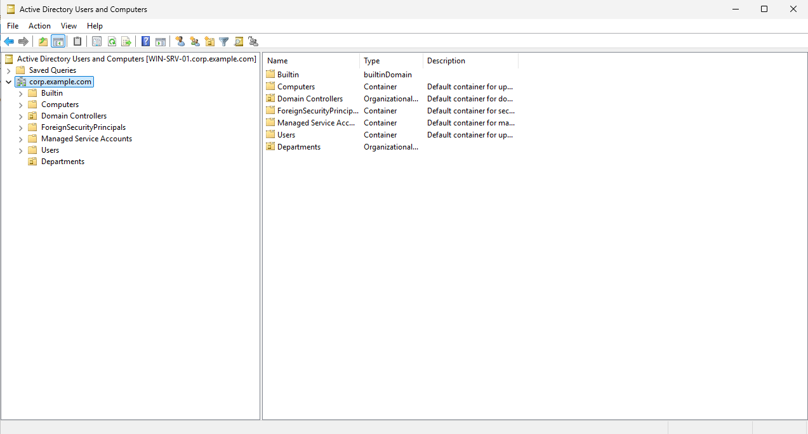
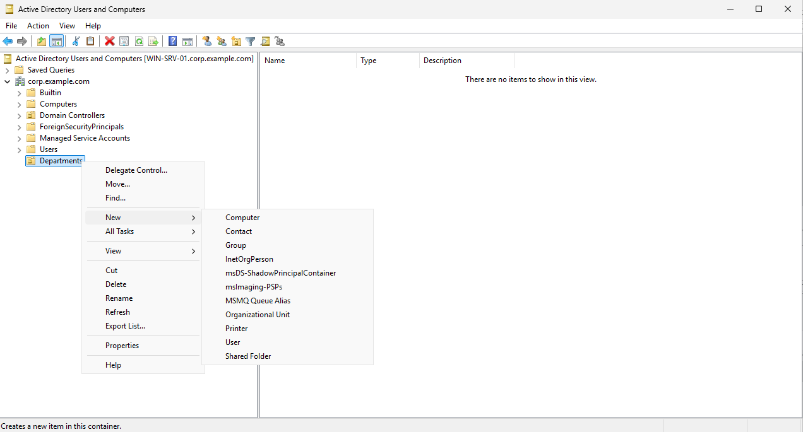
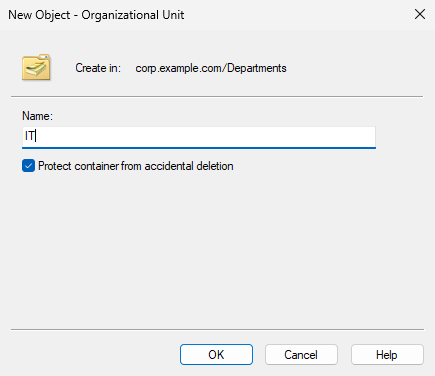
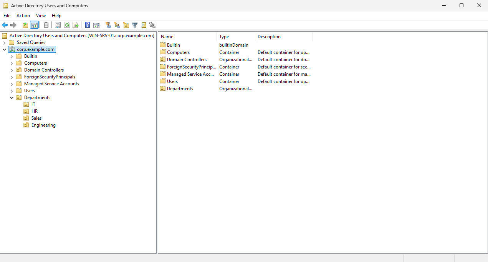
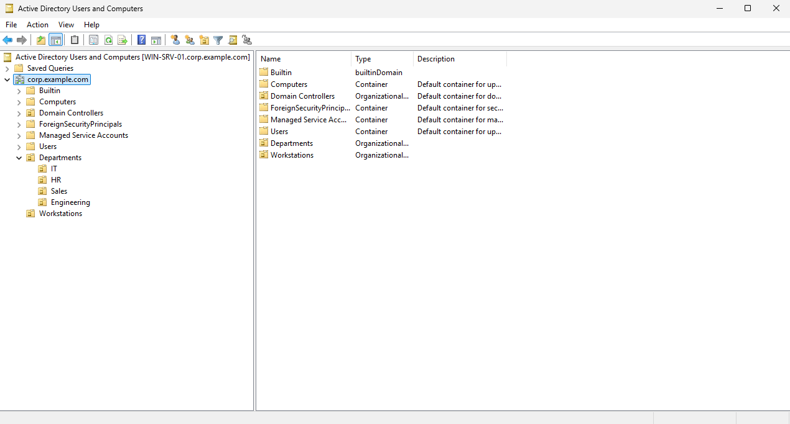
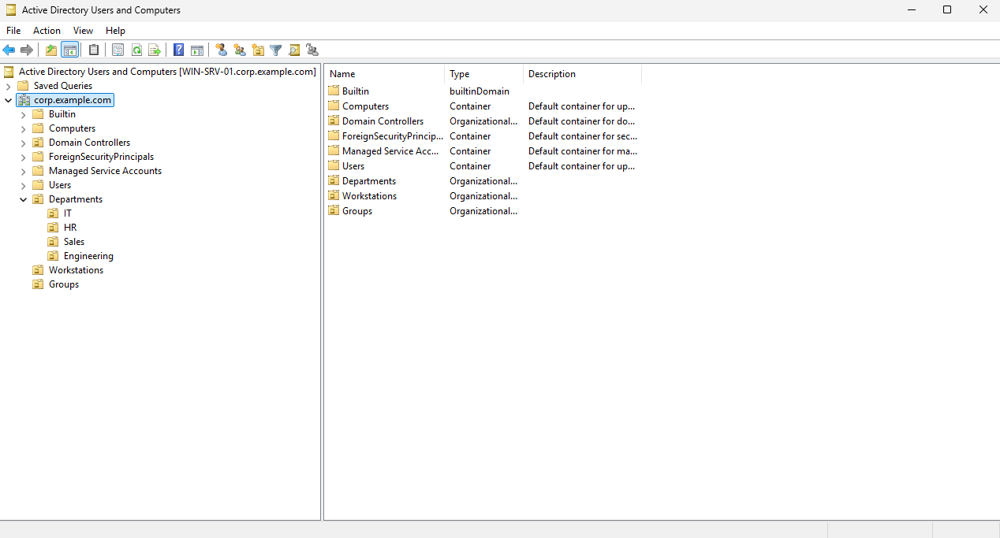

# Create Organizational Units

## Overview

This document demonstrates how to create a simple Organizational Unit (OU) structure in Active Directory Users and Computers (ADUC). In this lab, OUs are used to separate administrative areas by department and function.

The following OUs will be created:

- Departments
    - IT
    - HR
    - Sales
    - Engineering
- Workstations
- Groups

## Why Organizational Units?

Organizational Units help organize objects such as users and computers inside Active Directory.

They're commonly used to:

- Keep domain structured and easier to navigate
- Separate users and computers by department or function
- Apply Group Policy to specific parts of the domain
- Delegate Administrative control when needed

> [!note]
> It's important to distinguish OUs from groups:
>
> **OUs**: Mainly for organization, delegation, and Group Policy
> **Groups**: Mainly for permission and access control

## Environment

- Domain Controller: `WIN-SRV-01`
- Domain: `corp.example.com`
- Tools: `Active Directory Users and Computers (ADUC)`

## Prerequisites

- Windows Server 2025 setup (See: [Windows Server Setup](../README.md))

## Initial State

The domain contains default built-in containers and folders such as:

- Builtin
- Computers
- Domain Controllers
- ForeignSecurityPrincipals
- Managed Service Accounts
- Users

## Creating Organizational Units

### 1. Open Active Directory Users and Computers

On the domain controller, open `Server Manager`. In the top right, click `Tools` and select `Active Directory Users and Computers`.

Once opened, expand the domain in the left pane to view the existing strcture.

### 2. Create the parent OU for departments

Create a top-level OU named `Departments`.

1. Right click the domain name: `corp.example.com`.
2. Select `New`, then click `Organizational Unit`.

3. Enter the name: `Departments`
4. Leave `Protect container from accidental deletion` enabled.
5. Click `OK`.

The `Departments` OU should now appear under the domain root.

### 3. Create the child OUs for each department

Create a separate child OU under `Departments` for each department.

1. Right click `Departments`.
2. Select `New`, then click `Organizational Unit`.

3. Create a child for each department

4. Repeat for each department

Each department OU will appear nested under the `Departments` parent OU. It should look similar to this:

This structure keeps user accounts organized and makes it easier to manage department-based administration.

### 4. Create the Workstations OU

To keep client computers organized separately from users, create a top-level OU named `Workstations`.

The steps are similar to creating the top-level OU for `Departments`.

It should look like this at the end:

This OU will be used to move joined client machines out of the default `Computers` container and into a cleaner structure.

### 5. Create the Groups OU

Create a top-level OU named `Groups`.

The steps are similar to creating the top-level OU for `Departments` and `Workstations`.

It should look like this at the end:

This OU will be used to store and organize security groups created for departments, permissions, or administrative purposes.

## Result

The domain now contains a simple OU structure that is easy to follow and expand. This layout provides a good foundation for future Active Directory tasks such as:

- Creating user accounts in department-specific OUs
- Joining client systems to the domain and moving them into `Workstations`
- Creating security groups inside `Groups`
- Testing Group Policy

## Closing Notes

- The `Users` folder is a built-in container, not a standard OU.
- The `Computers` folder is a built-in container.
- For better organization, custom OUs should be created at the domain root.
