# Create User

This document shows how to create a new domain user in Active Directory on Windows Server. Then verify that the account can be used to sign in from a Windows client that joined the domain.

## Goal

Create a new user in Active Directory Users and Computers (ADUC) and confirm the account exists in the domain.

## Prerequisites

Before starting, make sure:

- Active Directory Domain Services is installed
- Server has been promoted to a Domain Controller
- The client has already joined the domain

See:
- [Active Directory Setup](../README.md)
- [Join W11 VM to Domain](../../windows-11-client/tasks/join-domain.md)

## 1. Open Active Directory Users and Computers

On `Server Manager`:

1. On the top right, click `Tools`.
2. Select `Active Directory Users and Computers` from the dropdown.

This opens the ADUC console where domain users, groups, and computers can be managed.

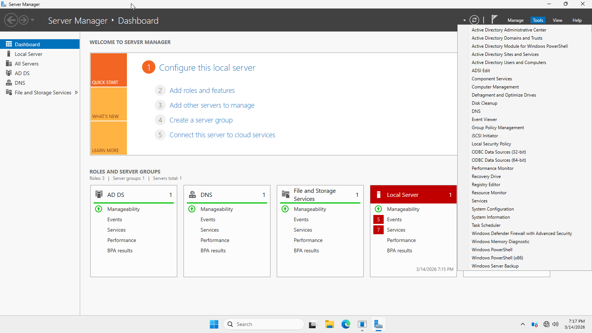

> [!note]
> You should be able to see the Windows 11 VM that you joined to the domain under Computers.

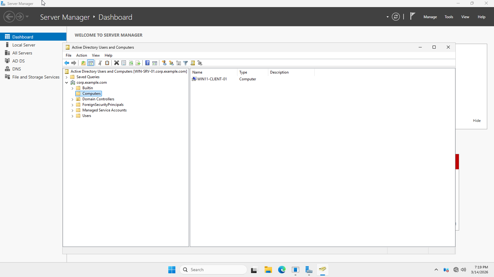

## 2. Navigate to the location for a new user

In the left pane, expand your domain name.

Choose where you want to create the user. For a simple lab setup, placing the account in the default `Users` container is fine.

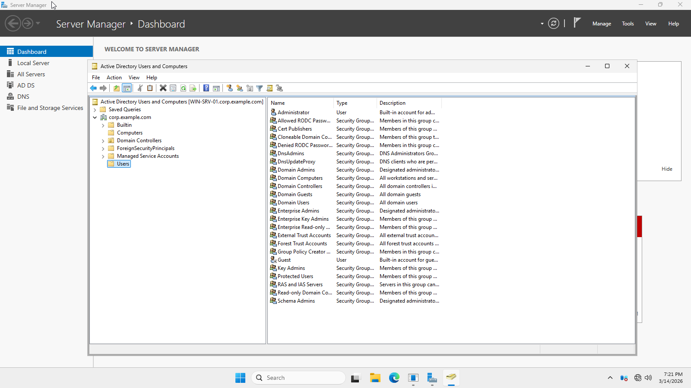

## 3. Create a new user

1. Right click the `Users` container.
2. Select `New`.
3. Click `User`.

This is where you create a new user.

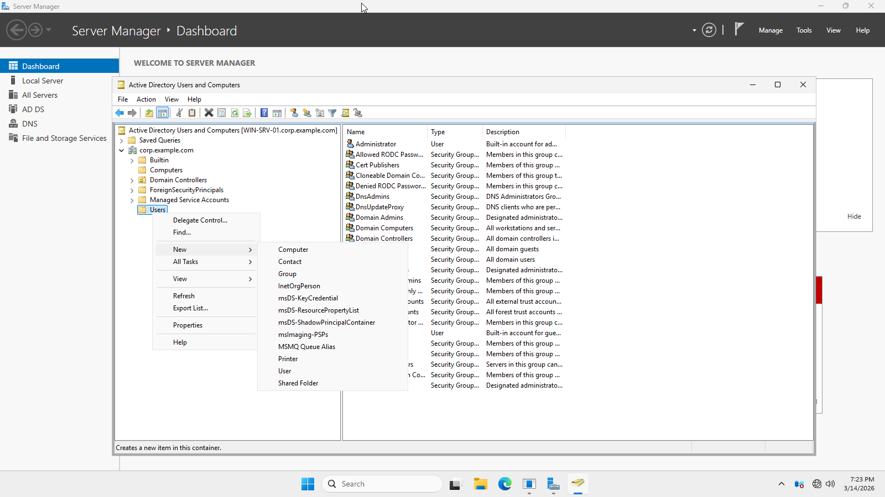

## 4. Enter the user's information

Fill in the user details:

- `First name`
- `Last name`
- `Full name`
- `User logon name`

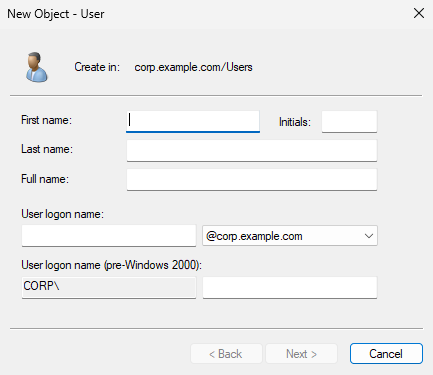

I will be creating this user:

- First name: `Thor`
- Last name: `Odinson`
- User logon name: `odithor`

Once filled out, click `Next`.

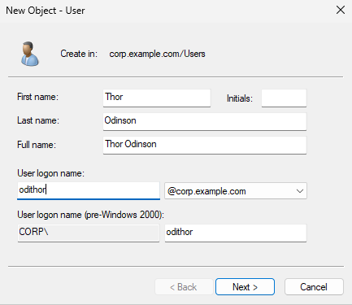

## 5. Set the password

Enter an initial password for the user.

You also have several account options:

- `User must change password at next logon`
- `User cannot change password`
- `Password never expires`
- `Account is disabled`

For a regular user, it's common to leave `User must change password at next logon` checked.

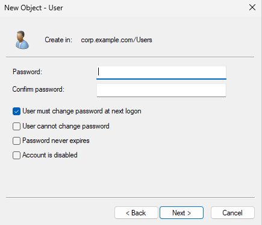

## 6. Finish creating the user

Review the summary page, then click `Finish`.

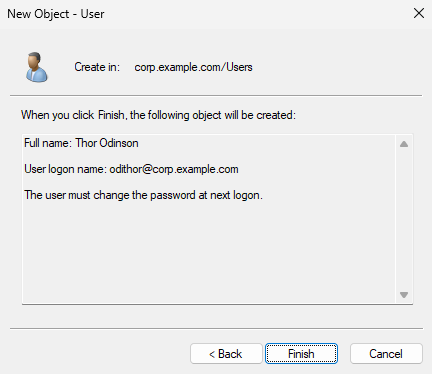

The created user should now appear in the selected container. Right click the user and select `Properties`. Take the time to look at the different properties.

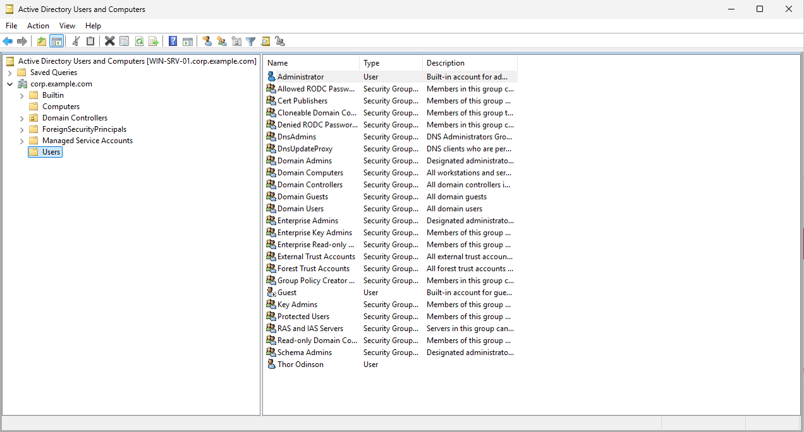

## 7. Test sign-in from a domain-joined client

On a Windows client joined to the domain:

1. Select `Other user` in the bottom left

    - 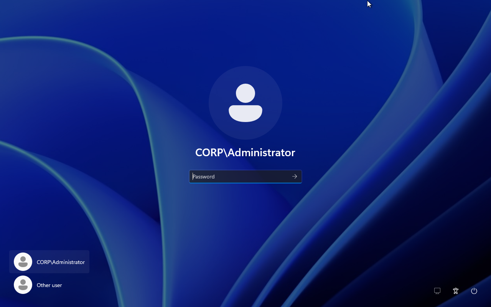

2. Sign in using either:
    - `DOMAIN\username`
    - `username@domain.name`

    - 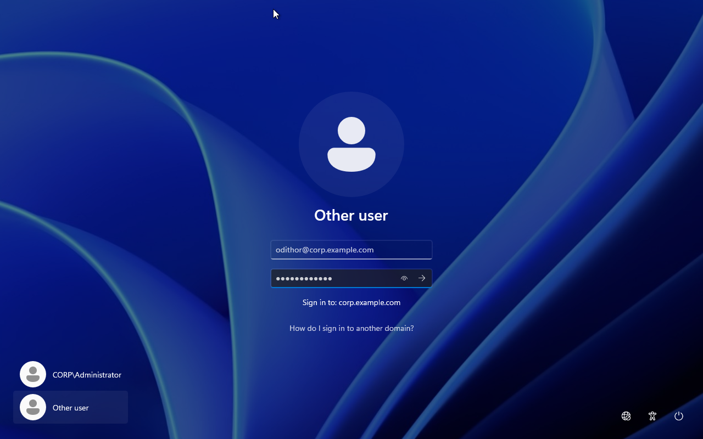

If you left the `User must change password at next logon` checked, you will see the prompt to change the user's password.

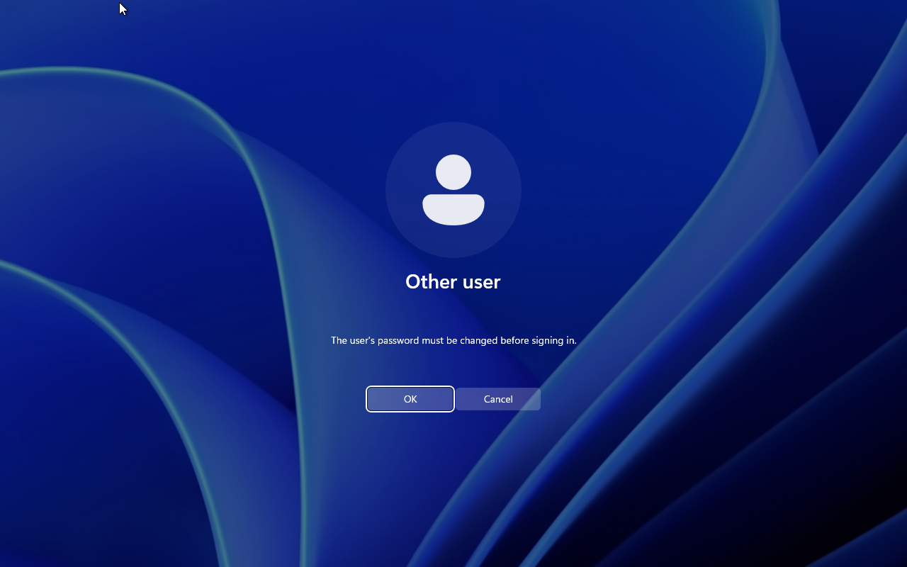
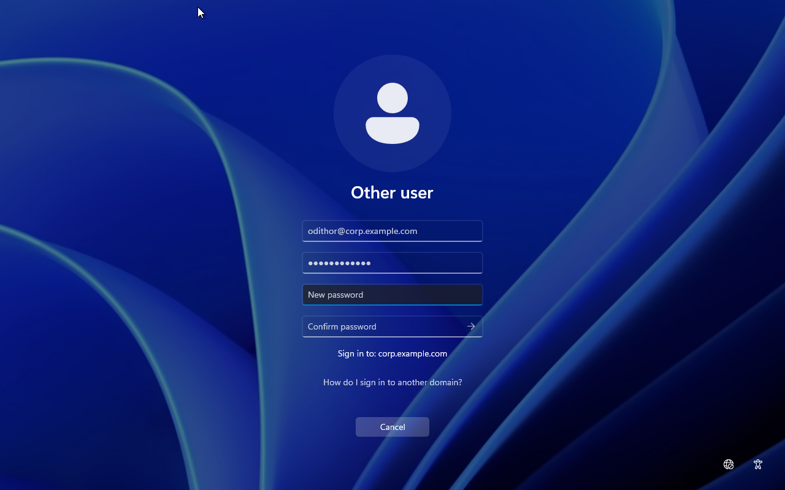
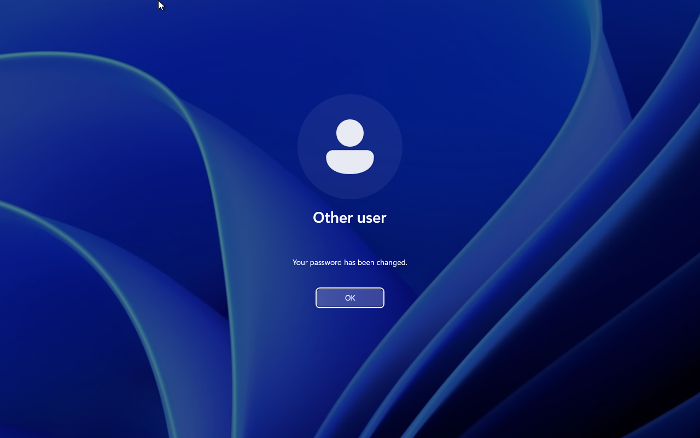

## 8. Verify user

When logged on, verify the user by clicking the start menu. Then click on the user. You should see the `First name`, `Last name`, and the `logon name with domain`.

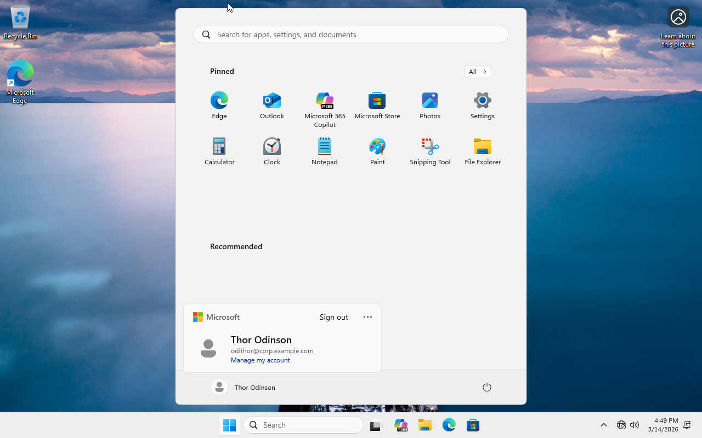

## 9. Congratulations

You've successfully added a new user in Active Directory using ADUC and verified that the account can sign in from a domain-joined client.
