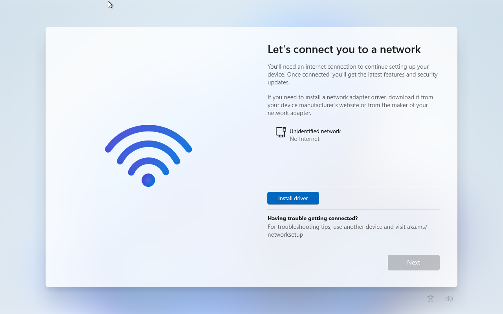
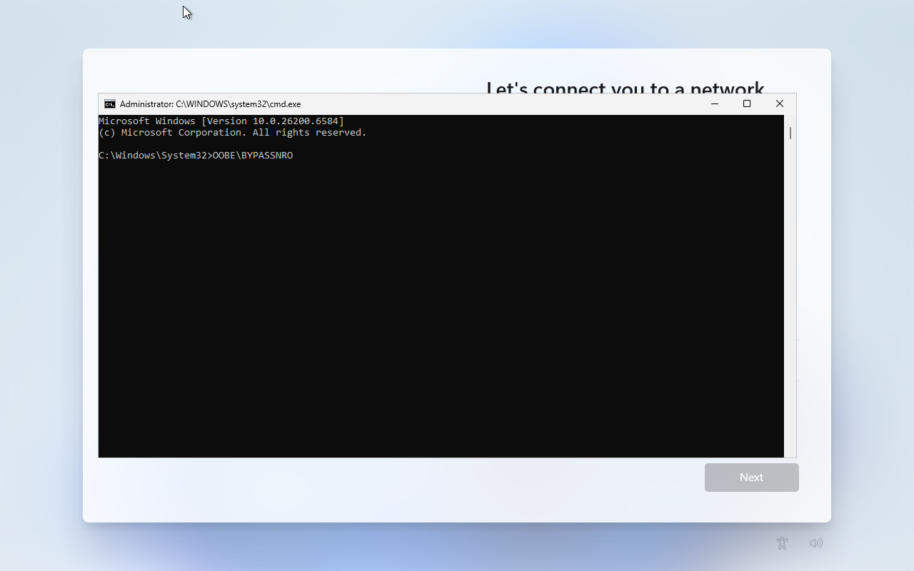
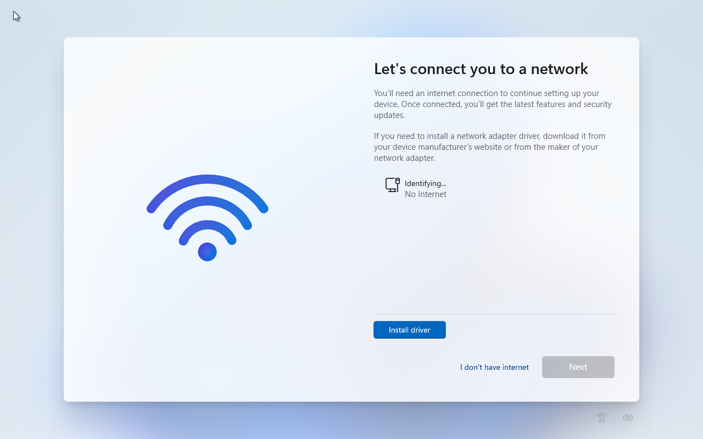
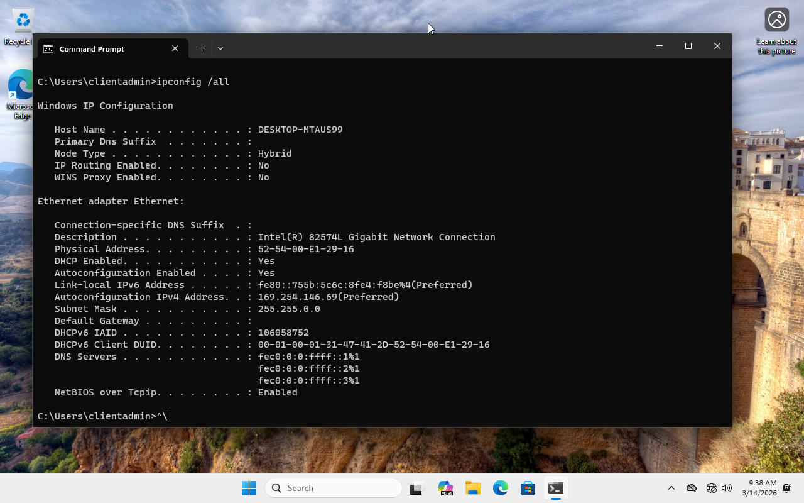
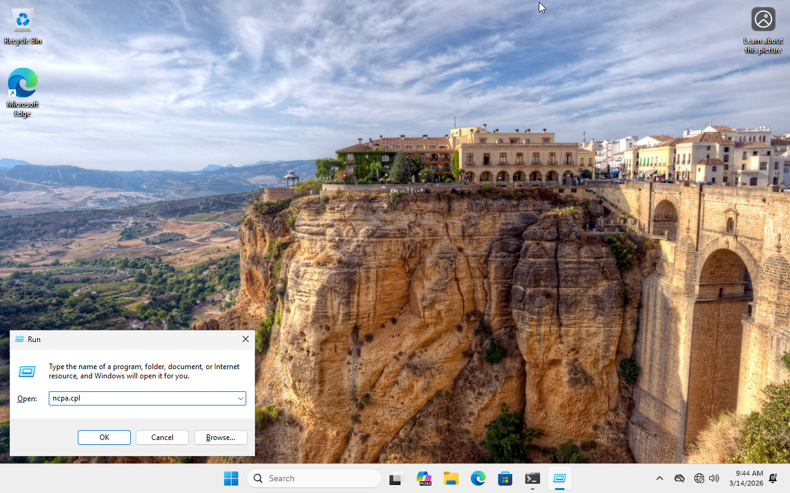

# Troubleshooting

This document will show any issues with setting up the enterprise environment.

## Bypass `Connecting to Network`

> [!note]
> When creating a Windows 11 VM in an isolated virtual network, it may ask you to connect to a network.
>
> `OOBE\BYPASSNRO` bypasses mandatory internet connection and Microsoft Account requirements.

To bypass this:
- Press Shift + F10
- Then type: `OOBE\BYPASSNRO`

    

- Windows should then restart on its own

Now when you go through the installation process and get back to the `Let's connect you to a network`, you should see an option to select `I don't have internet`.

## Receiving an APIPA

After creating a fresh Windows 11 VM and bypassing connecting to the network, I received an APIPA. This is intended because the current setup of Active Directory doesn't provide DHCP. 

We have two options:

- Option 1: Configure DHCP on Windows Server
- Option 2: Set a static IP on the Windows 11 VM

We will perform Option 2.

### View Network Connections

1. Open the Run dialog with `Win + R`. Alternatievly, open the start menu.

2. Type `ncpa.cpl`. (NCPA is Network Control Panel Applet)

    

3. The steps for setting a static IP address can be replicated in steps 3 - 5 [here.](./active-directory/README.md/#3-set-a-static-ip-address)
