# pfSense for Enterprise Simulation

This documents how pfSense is configured for the `enterprise-simulation` lab.

> [!note]
> This is **not** a pfSense installation guide. (See: [pfSense Setup](../../../pfSense/setup/README.md))

## Overview

pfSense is used as the:

- Default Gateway
- Firewall
- DHCP Server
- Path to upstream internet access

The domain controller will handle:

- Active Directory
- DNS for the domain
- Authentication
- Group Policy

## DNS Note

> [!note]
> Even though pfSense provides DHCP, **domain clients should use the domain controller as their DNS server**.

To clarify:

- pfSense hands out IP addresses
- pfSense hands out the **domain controller IP as DNS**
- Clients query the domain controller for DNS
- Domain controller forwards unknown queries upstream

## Lab Layout

### WAN

The WAN interface should connect to an upstream network (NAT).

### LAN

The LAN interface should still remain as an isolated, internal lab network.

This network will contain:

- pfSense LAN
- Windows Server 2025 domain controller
- Windows 11 domain-joined VM

## Networking Addressing

- Network: `192.168.40.0/24`
- pfSense LAN: `192.168.40.1`
- Domain Controller: `192.168.40.10`
- DHCP Range: `192.168.40.100 - 192.168.40.199`

## Prerequisites

Before continuing, ensure that:

- pfSense is already installed
- WAN and LAN interfaces are assigned
    - WAN is connected to an upstream network
    - LAN is connected to an isolated lab network
- Windows Server 2025 VM exists
- Both VMs can be placed on the pfSense LAN

## pfSense Configuration

### 1. Start with the base pfSense setup

Follow the normal pfSense installation and interface assignment process, see:

[pfSense Setup](../../../pfSense/setup/README.md)

In this lab:

- WAN: Default `NAT`
- LAN: Isolated lab network

### 2. Select WAN interface

Compare the MAC address of the attached NIC and select the appropriate interface.

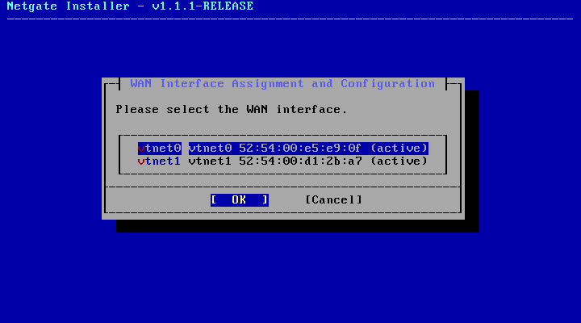

### 3. Select LAN interface

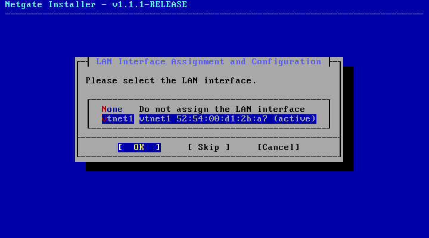

Set the IP address to the LAN network where the domain controller and clients reside in.

In my case:

- IP Address: `192.168.40.1/24`
- DHCP Enabled: `true`
- DHCPD Range Start: `192.168.40.100`
- DHCPD Range End: `192.168.40.199`

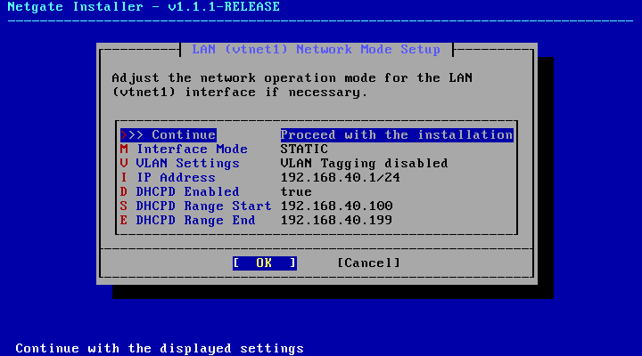

### 4. Verify pfSense installed properly

Once pfSense is complete, verify the configurations in the console.

## Domain Controller

Follow the normal Windows Server and Active Directory setup here:

- [Windows Server Setup](../../../virtualization/windows-server-2025/README.md)
- [Active Directory Setup](../active-directory/README.md)

### 1. Set the default gateway

Now that pfSense is configured and running, it will act as the default gateway.

1. Enter `ncpa.cpl` in the Run Dialog (Win + R)

    - 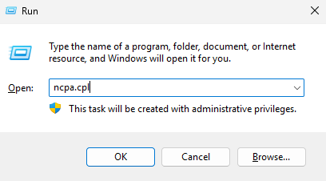

2. Right click the adapter and select `Properties`.
3. Click on `Internet Protocol Version 4 (TCP/IPv4)` and then `Properties`.

    - [open ipv4](./screenshots/05-adapter-properties.png)

4. Set the Default gateway to the pfSense LAN IP.

    - 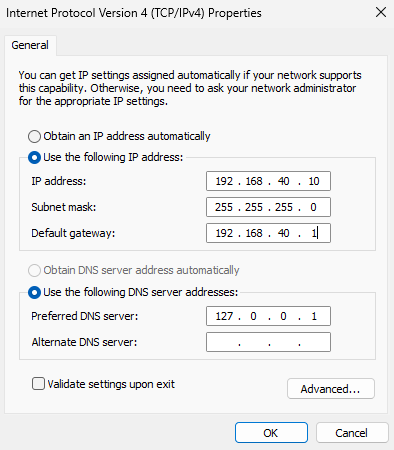

> [!note]
> The preferred DNS server is the IP address of the domain controller (localhost)

Then give it time for the network to initialize.

### 2. Verify network configurations

Run: `ipconfig /all`

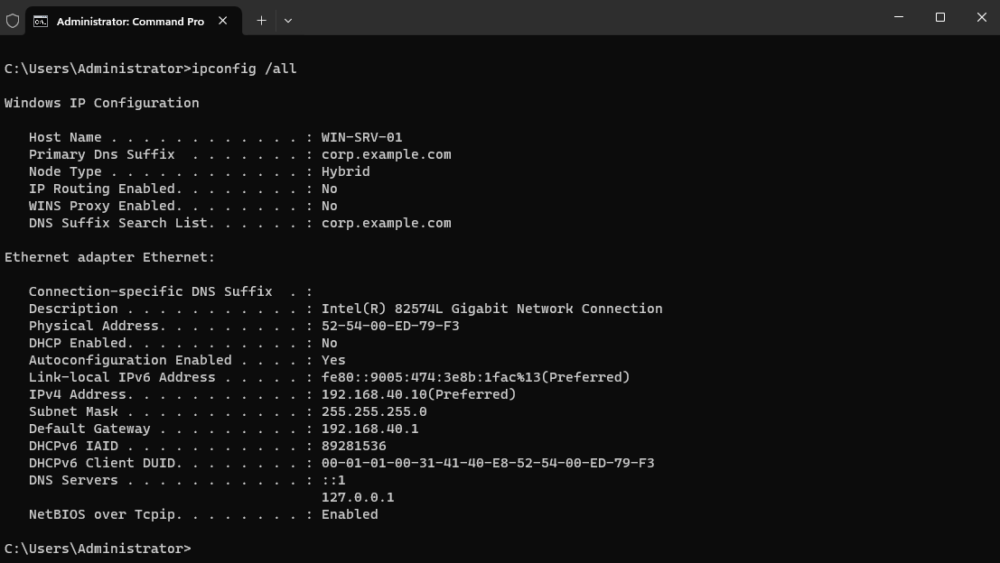

You should be able to ping `google.com` or `8.8.8.8`.

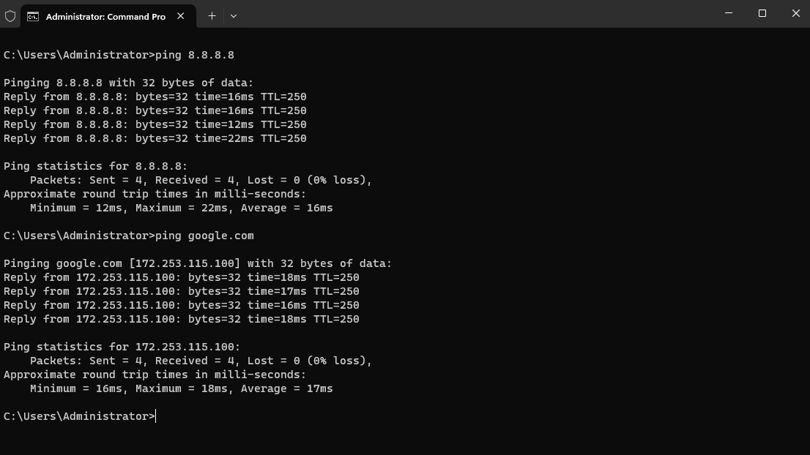

### 3. Complete pfSense setup on the webConfigurator

Access the pfSense web UI by entering the pfSense LAN IP on a browser in the network.

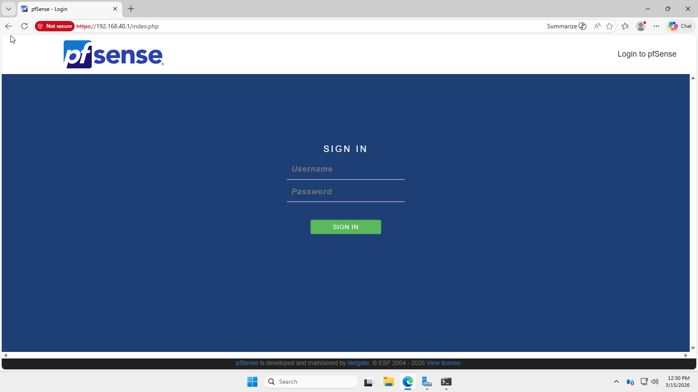

Default credentials:

- Username: `admin`
- Password: `pfsense`

> [!warning]
> Change default credentials immediately.

Proceed with pfSense setup until you reach the dashboard.
When it asks for `Primary DNS Server`, set the Domain Controller.

### 4. Domain Controller should be fully setup

You should now be able to access the internet on the Windows Server.

## Windows Client

Follow the normal Windows client setup here:

- [Windows 11 VM Setup](../../../virtualization/windows-11/README.md)

The VM must be joined to the domain. You can follow the setup here:

- [Windows 11 Domain Join](../windows-11-client/tasks/join-domain.md)

### 1. Log into a domain user

At the moment, you should not have internet access.

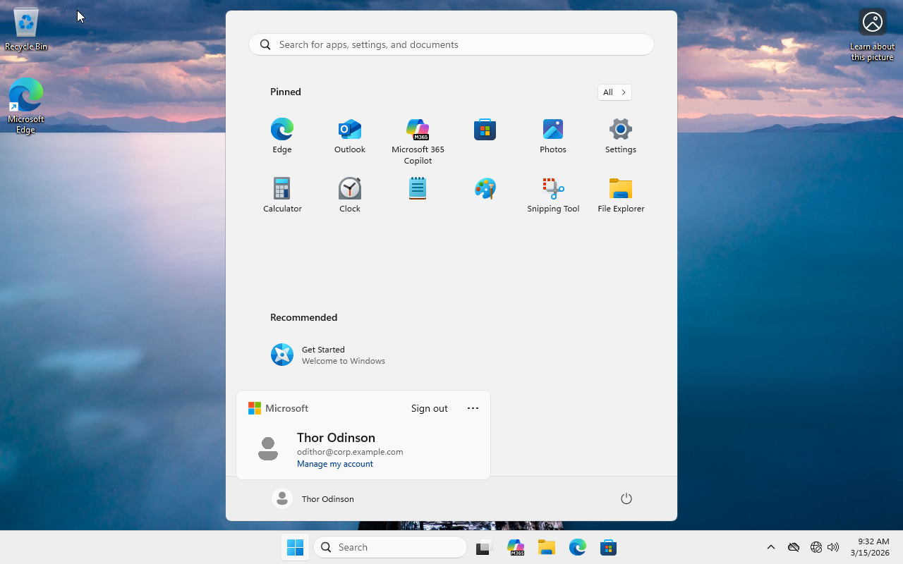

### 2. Utilize DHCP

> [!note]
> By default, changing default gateway requires administrative permissions
> If the domain user does not have permissions, you will be prompted to enter admin credentials

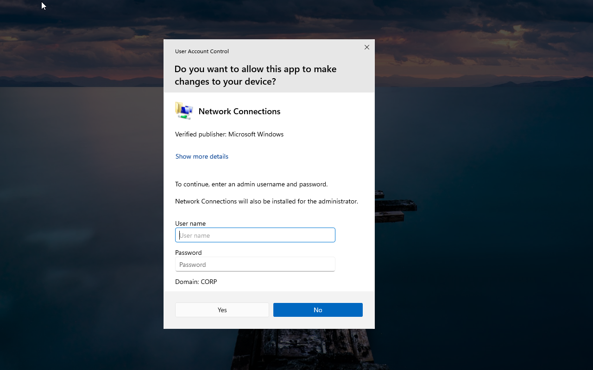

Follow the same steps in [Step 1](#1-set-the-default-gateway).

Since DHCP is configured via pfSense, you should now be able to select:

- `Obtain an IP address automatically`: Enabled
- `Obtain DNS server address automatically`: Enabled

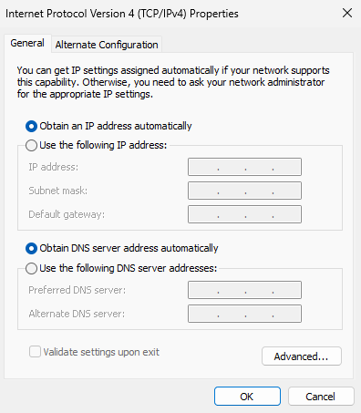

### 3. Verify network configurations

Run: `ipconfig /all`.

- See what IP address DHCP assigned the VM. It should be in the range that you defined in pfSense.
    - In this case, I received the first available IP address in the range.
- Default gateway should be pfSense LAN IP
- DNS should be the IP of the domain controller.

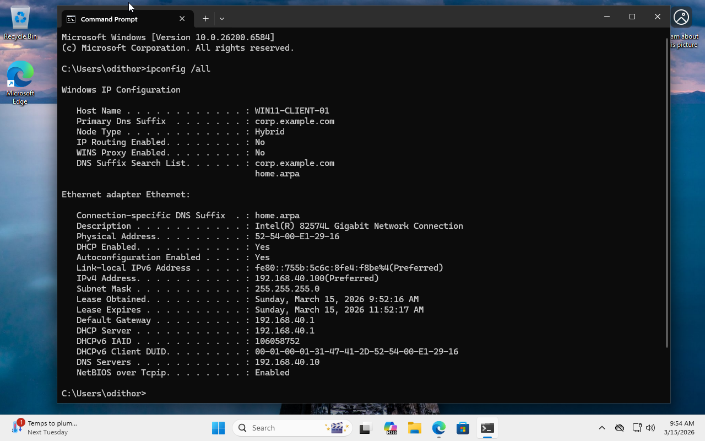

### 4. Windows Client should be fully setup

You should now be able to access the internet on the Windows client.

### Optional. Since Windows Client uses DHCP, it should show up in pfSense web UI

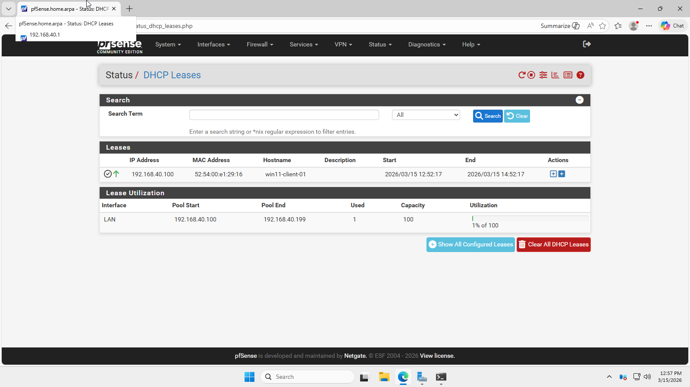

## Congratulations

You've set up pfSense for the `enterprise-simulation` lab.

At this point:

- pfSense is installed and running as a separate VM
- WAN interface is connected upstream
- LAN interface is configured as the isolated lab network
- pfSense is acting as the default gateway
- Windows client uses DHCP
