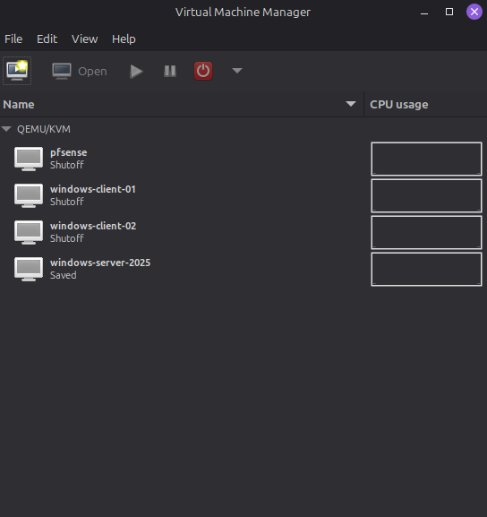
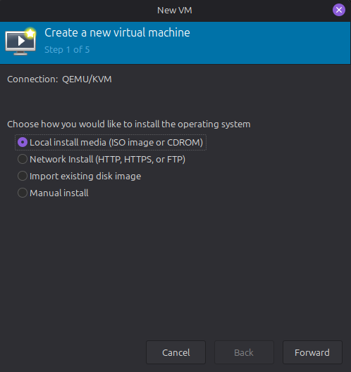
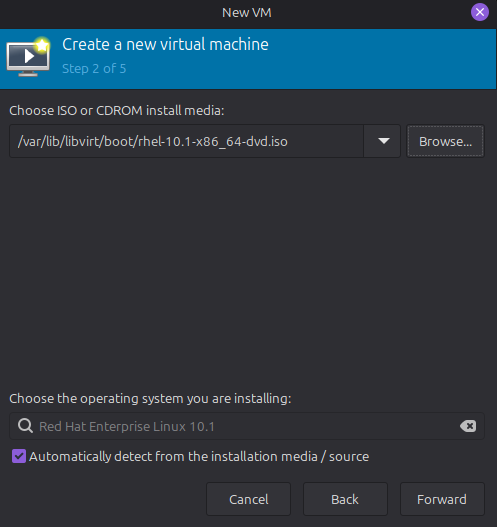
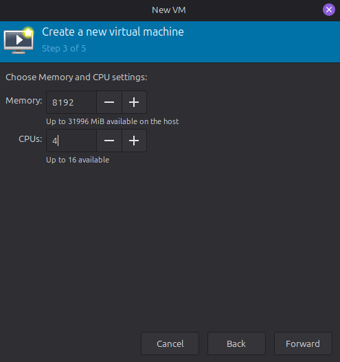
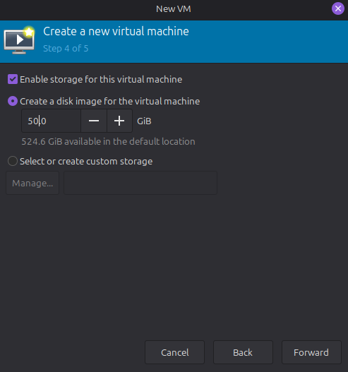
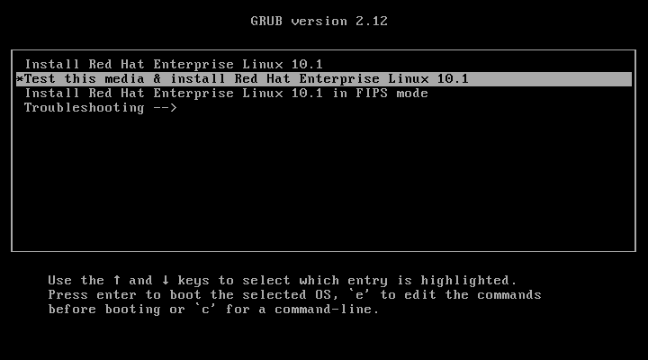
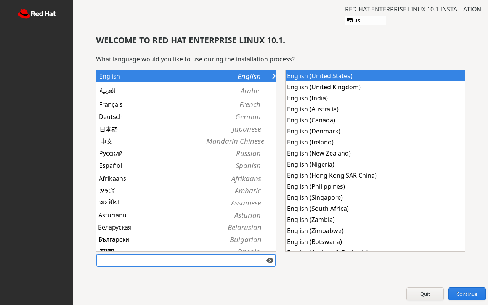
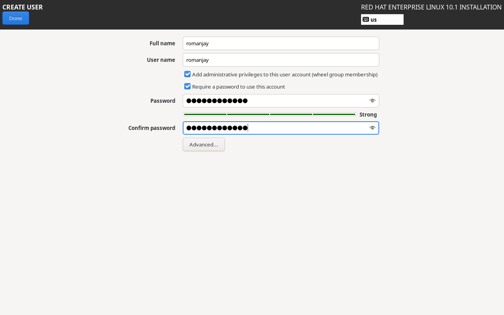
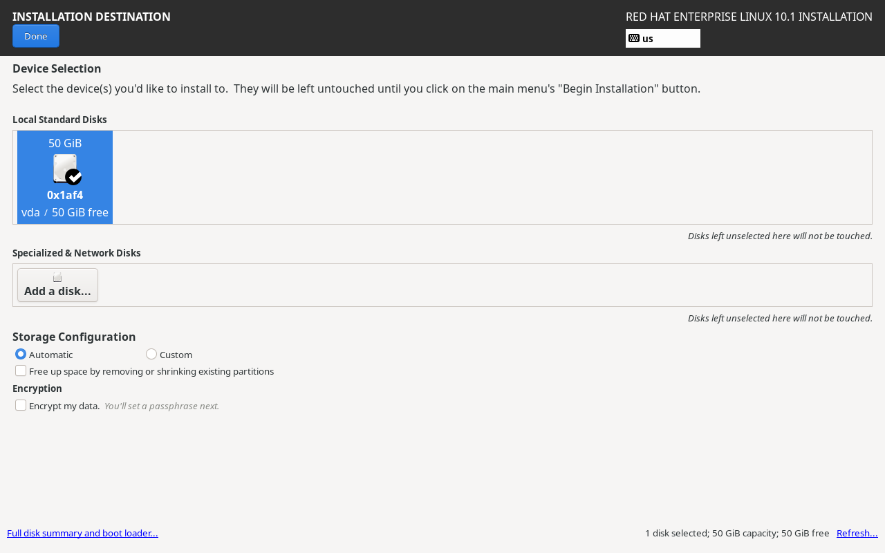
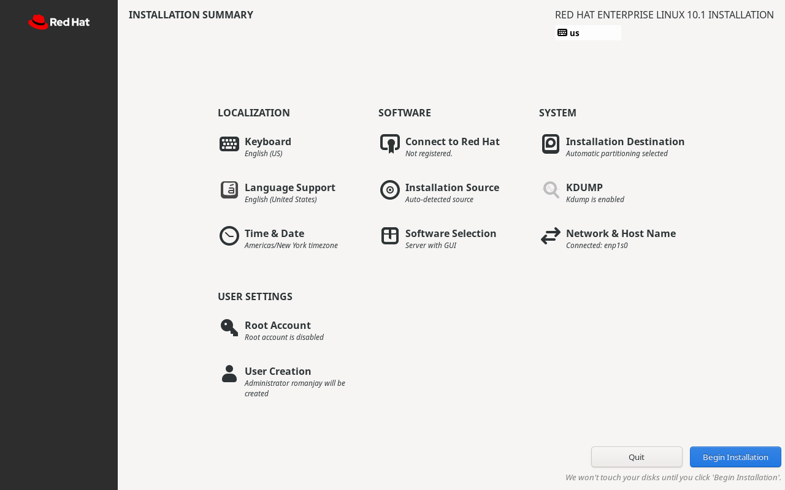

# Red Hat Enterprise Linux VM Setup

This documents walks through creating and installing a fresh RHEL VM from scratch using `QEMU/KVM` and `virt-manager`.

## Goal

The purpose of this VM is to create a clean RHEL installation that will be used as my lab environment for preparing for RHCSA

## Prerequisites

Before starting, ensure the following:

- QEMU/KVM is installed on the host (see: [steps 1 - 4](../ubuntu/README.md#1-update-the-host))
- virt-manager is installed
- RHEL DVD-ISO is downloaded
- Available host resources for VM

## RHEL VM Settings

- `Host System`: Linux Mint
- `Hypervisor`: QEMU/KVM and virt-manager
- `Guest OS`: RHEL 10.1
- `VM Name`: rhel
- `Memory`: 8192
- `CPU`: 4
- `Disk`: 50 GB
- `Network`: NAT

## 1. Create the Virtual Machine

- Open `virt-manager` and create a new virtual machine.

### Create a new virtual machine

- Select `Local install media (ISO image or CDROM)`.

### Browse for the ISO

- Browse to the ISO and select it.

- `virt-manager` should automatically detect RHEL.

### Choose the Memory and CPU settings

- Set the VM resources.
- 2GB RAM is sufficient.

### Create the disk image

- Create the storage for the virtual machine.
- 20GB is sufficient

### Name the VM and Review

- You can optionally customize configuration before installing.

> ![note]
> RHCSA is conducted without internet access.

## 2. RHEL Setup

- You will be greeted with GRUB.
- Proceed with `Install Red Hat Enterprise Linux 10.1`

### Select language

### Installation Summary

- You need to configure a user and installation destination before proceeding.

> ![warning]
> Root Account should remain disabled.

#### Create User

- Make sure `Add administrative privileges to this user account` is selected.

#### Installation Destination

- Ensure the virtual disk is selected.
- Storage configuration can remain automatic.

#### Network and Host Name

- Optionally change host name.
  - Default would be `localhost.local`

### Begin Installation

- Once you've configured a user account and selected an installation destination, select `Begin Installation`

